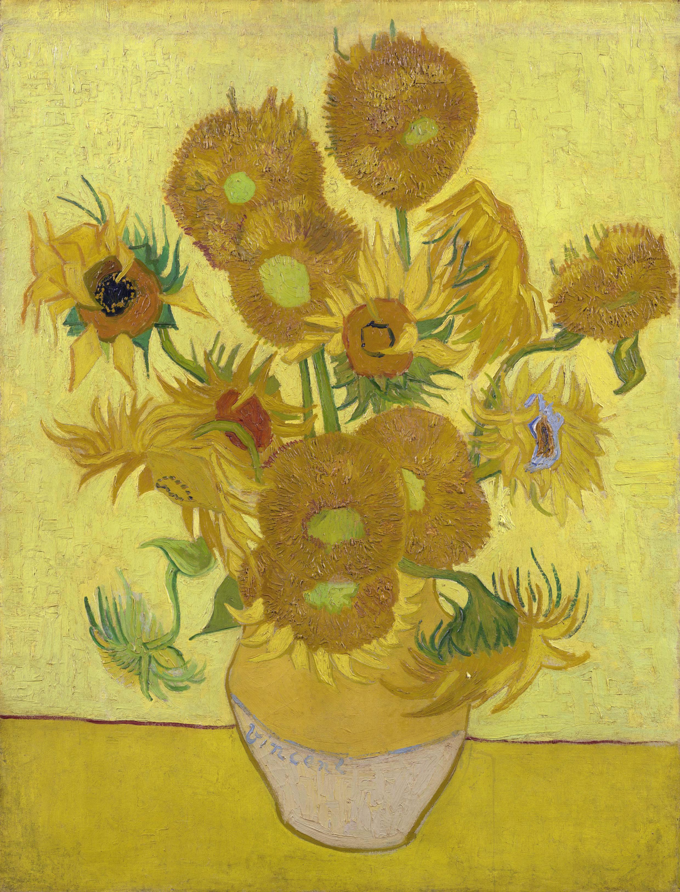

## 基本信息

- 作者：[[凡·高 Vincent van Gogh]]
- 创作年代：1889
- 材质：布面油画 (*not from wiki*)
- 尺寸：约 92 × 73 cm (*not from wiki*)
- 现存地：伦敦国家美术馆等多个版本 (*not from wiki*)

## 画面与技法

凡·高最著名的静物系列之一。1888 年凡·高在阿尔为迎接高更到来而绘制向日葵以装饰黄房子；本作（标注 1889）属于他在精神崩溃后重画的同主题版本之一。明亮的铬黄、厚涂笔触、单色背景。

## 历史背景 (*not from wiki*)

向日葵系列共有数幅版本，分藏于伦敦、慕尼黑、阿姆斯特丹、费城、东京（已毁于二战）等地。

## 图片清单

| 编号 | 出自 | 描述 |
|---|---|---|
| 01 | [[059｜凡·高3：他为什么走向毁灭？]] | 十五朵装于陶罐的向日葵 |

## 出现在

- [[059｜凡·高3：他为什么走向毁灭？]]
