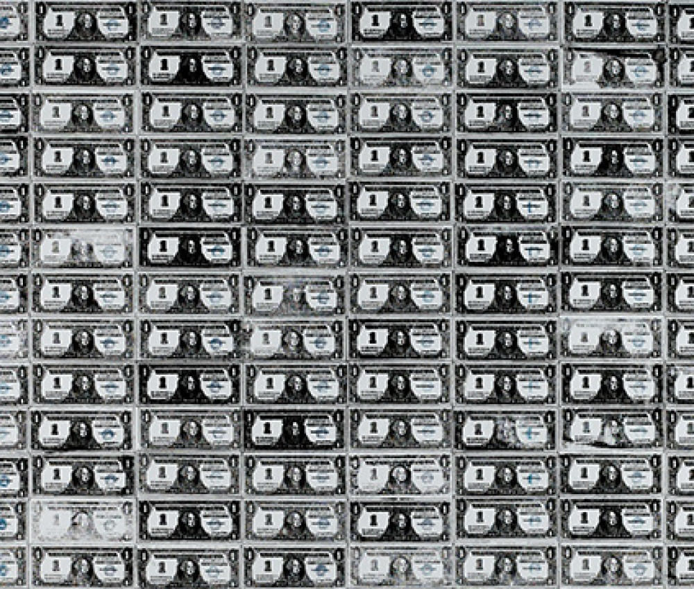

## 基本信息

- 作者：[[安迪·沃霍尔 Andy Warhol]]
- 创作年代：1962
- 材质：[[丝网印刷 Silkscreen]] / 铅笔于亚麻布
- 尺寸：（*not from wiki*）242.6 × 192.4 cm
- 现存地：（*not from wiki*）私人收藏
- 拍卖纪录：**2012 年拍出 4300 万美元**（顾衡 098 明确给出）

## 画面与技法

把**一美元纸币正面**用 [[丝网印刷 Silkscreen]] 网格排列 200 次——20 行 × 10 列。每张钱本身、油墨网格、装裱过程都共同强调"复制"的核心地位。

顾衡 098 把它作为本课的收束式视觉——上接对沃霍尔"流量思维"的解读，下接对"绝大多数艺术家无法以艺术创作作为谋生手段"的反思：**艺术品 = 钱**，是终极的拟真——艺术不再代表别的东西，它就是钱。

## 历史背景 (*not from wiki*)

- 1962 沃霍尔早期作品；2012 在苏富比拍出 4385 万美元，远超估价，成为当时沃霍尔作品高价代表。
- 题材源于沃霍尔母亲的一句话："你不如就画钱吧"——母亲眼中钱才是大众真正崇拜的符号。

## 图片清单

| 编号 | 出自 | 描述 |
|---|---|---|
| 01 | [[098｜波普艺术：流行文化如何成为艺术？]] | 全画 20 × 10 网格 |

## 出现在

- [[098｜波普艺术：流行文化如何成为艺术？]]
