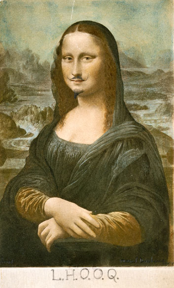

## 基本信息

- 作者：[[杜尚 Marcel Duchamp]]
- 创作年代：1919
- 材质：现成印刷品（*Mona Lisa* 明信片）+ 铅笔涂改
- 尺寸：19.7 × 12.4 cm (*not from wiki*)
- 现存地：私人收藏 / 多个版本散在 (*not from wiki*)

## 画面与技法

杜尚买了一张《蒙娜丽莎》的明信片，在画面上画了两撇小胡子和山羊须，下方题字 *L.H.O.O.Q.*。法语连读 "Elle a chaud au cul" 直译"她屁股发热"——粗俗双关。

形式上是**现成品 (readymade) + 涂改**的经典操作，把"圣物"做成"段子"——典型的达达式祛魅。

## 历史背景

(*not from wiki*) 这件 1919 年的小作品与 1911 年《蒙娜丽莎》被盗案 (Vincenzo Peruggia 偷出卢浮宫，1913 年才追回) 并列，是 *Mona Lisa* 在 20 世纪一跃成为西方艺术最知名作品的两大推手——顾衡 016 论达·芬奇的"咸鱼翻身"由这两件偶然事件促成。

杜尚后续详谈见 [[088｜杜尚1：他"好好画画"是什么样子的？]] 及 089/090。

## 图片清单

| 编号 | 出自 | 描述 |
|---|---|---|
| 01 | [[016｜提香：为什么业界评价比达芬奇还高？]] | 整体图 |

## 出现在

- [[016｜提香：为什么业界评价比达芬奇还高？]]
