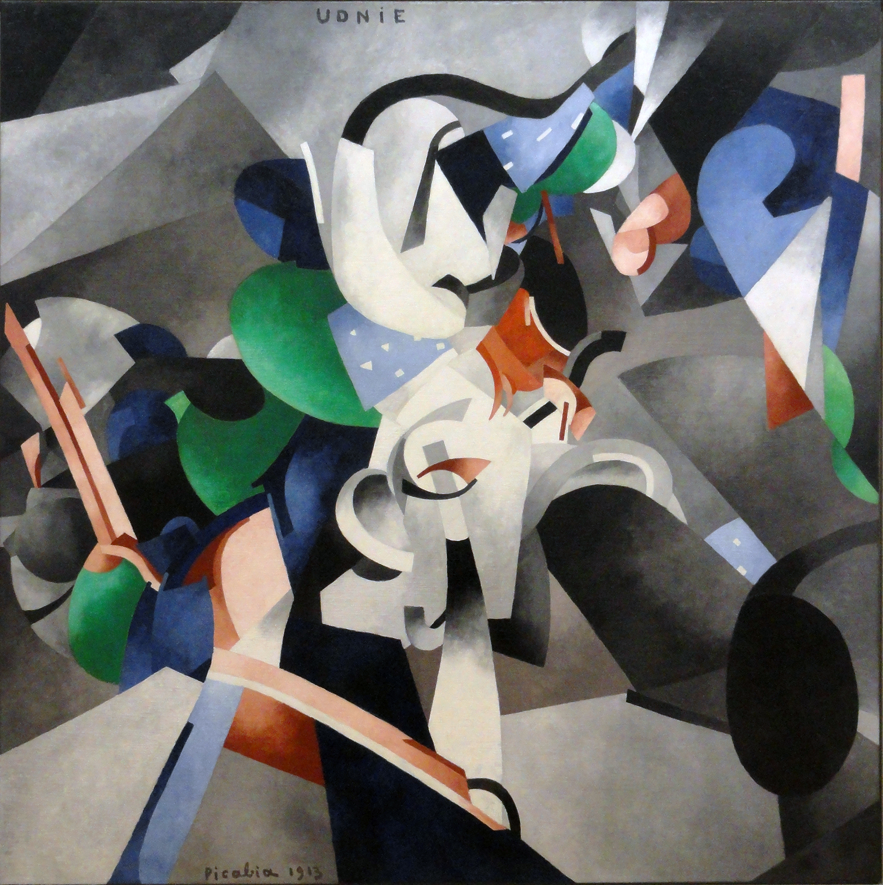

## 基本信息

- 作者：[[毕卡比亚 Francis Picabia]]
- 创作年代：1913
- 材质：布面油画 (*not from wiki*)
- 尺寸：约 290 × 300 cm (*not from wiki*)
- 现存地：巴黎蓬皮杜中心 (*not from wiki*)

## 画面与技法

[[毕卡比亚 Francis Picabia]] 1913 年作品——表现的是**他在 1913 年去美国（[[军械库展览 Armory Show]]）路上、对船上一个波兰女舞蹈家的性幻想** (顾衡的总结："精虫上脑")。

风格上受 [[德劳内 Robert Delaunay]] [[同时性绘画 Simultaneous Paintings]] 影响：色彩斑斓 + 旋转的圆盘式构图。但毕卡比亚不像德劳内那样导向"色彩抽象"的理论，而是直接画**性幻想**。

[[阿波利奈尔 Guillaume Apollinaire]] (*not from wiki*) 把这一类作品归入他所说的"无定形"。

## 历史背景

(*not from wiki*) 标题 "UDNIE" 据信是 "nudie" (裸女) 的字母重排——这正是毕卡比亚式的恶搞。

## 图片清单

| 编号 | 出自 | 描述 |
|---|---|---|
| 01 | [[091｜毕卡比亚：如何用绘画表现达达主义？]] | 整体图 — 旋转色环 + 性幻想 |

## 出现在

- [[091｜毕卡比亚：如何用绘画表现达达主义？]]
