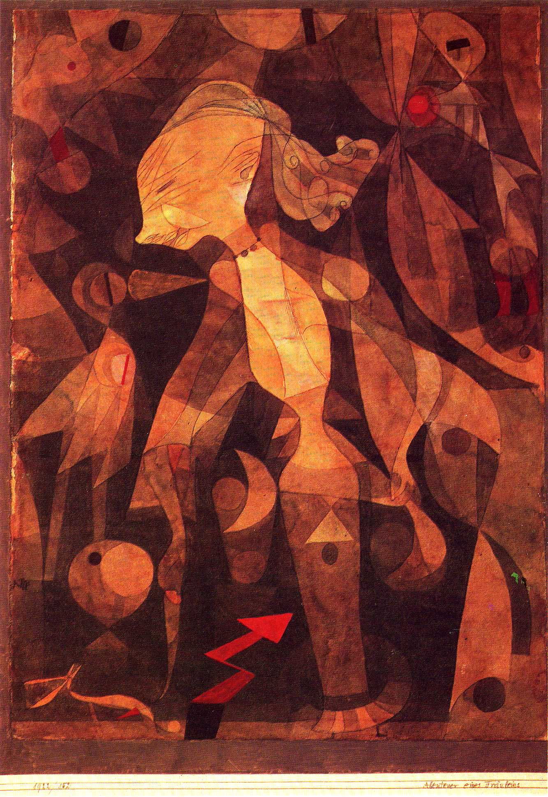

## 基本信息

- 作者：[[克利 Paul Klee]]
- 创作年代：1921
- 材质：水彩 (*not from wiki*)
- 现存地：伦敦·泰特美术馆 (*not from wiki*)

## 画面与技法

本讲核心举例：色彩与构图**乍看像 [[分析立体主义 Analytical Cubism]]**（褐色单色调 + 规则几何），但画面充斥着**与主题无关的小零碎**——克利自称为"无关紧要的附加物"。这是他**模仿儿童视角**的代表方法：

> 凭着直觉画出来的东西，当然也就很难确定它的主题。

这种"主题疏离"标志着克利与 [[康定斯基 Wassily Kandinsky]] 抽象路线的分岔点——克利的目标不是拒绝客观世界，而是**再造婴儿眼中的世界**。

## 历史背景

(*not from wiki*) 1921 年克利受邀加入 [[包豪斯 Bauhaus]] 任教，与 [[康定斯基 Wassily Kandinsky]] 重聚。这一时期他的"儿童视角"理念已经成熟。

## 图片清单

| 编号 | 出自 | 描述 |
|---|---|---|
| 01 | [[085｜克利：他为什么模仿小孩子画画？]] | 单色几何 + 零碎附加物的童稚视角 |

## 出现在

- [[085｜克利：他为什么模仿小孩子画画？]]
