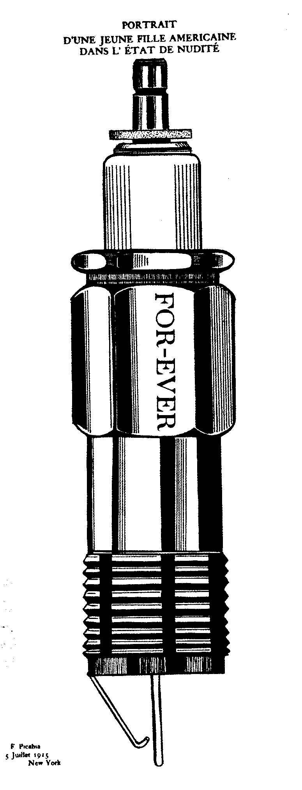

## 基本信息

- 作者：[[毕卡比亚 Francis Picabia]]
- 创作年代：1915
- 材质：纸面油彩 / 水粉 / 印刷 (*not from wiki*)
- 尺寸：年代不详 (*not from wiki*)
- 现存地：私人收藏 (*not from wiki*)

## 画面与技法

[[毕卡比亚 Francis Picabia]] **达达"机器画女人"期**——画面是一个**火花塞**的工程图，标题却是"年轻美国女孩 处于裸身状态"——典型的毕卡比亚式恶搞：把火花塞 = 女人 / 性的隐喻摆到明面上。

## 历史背景

(*not from wiki*) 1915 年发表在纽约达达圈杂志《291》上的"机器肖像"系列之一。毕卡比亚此前对美国机械工业的发达"受到了极大的触动"。

## 图片清单

| 编号 | 出自 | 描述 |
|---|---|---|
| 01 | [[091｜毕卡比亚：如何用绘画表现达达主义？]] | 整体图 — 火花塞工程图 / 标题恶搞 |

## 出现在

- [[091｜毕卡比亚：如何用绘画表现达达主义？]]
