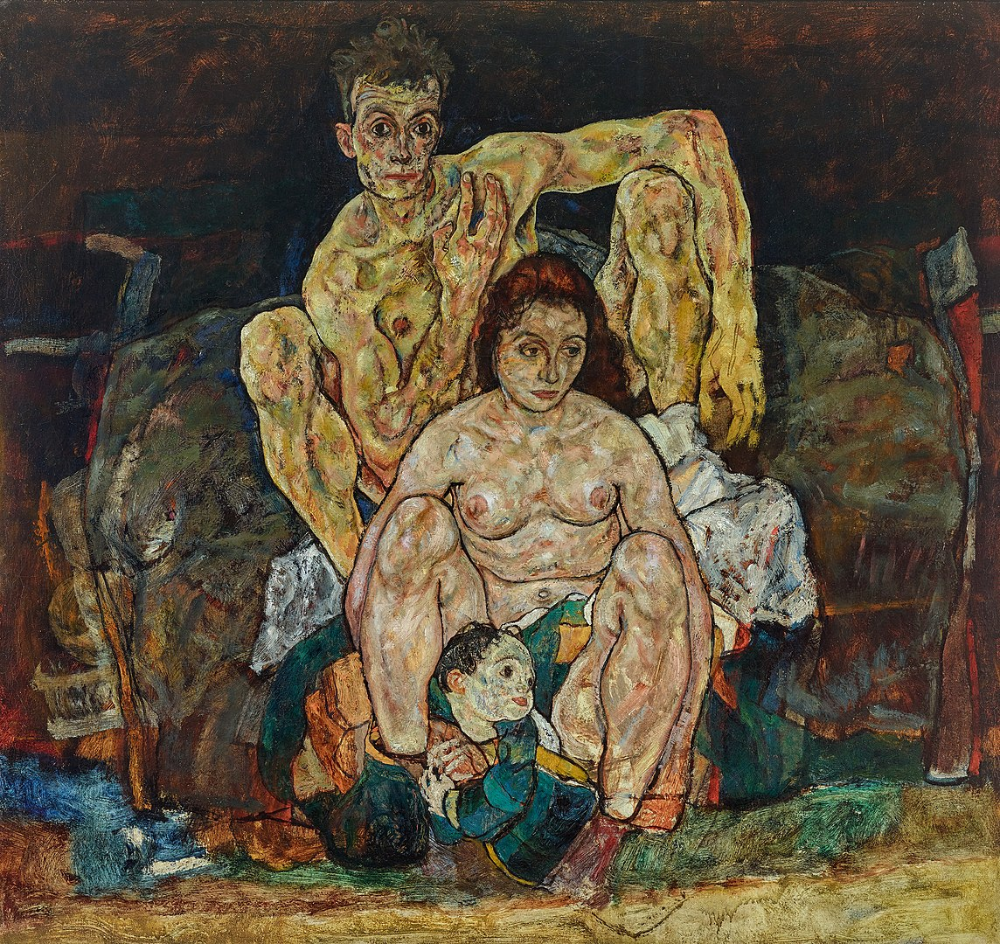

## 基本信息

- **作者**：[[席勒 Egon Schiele]]
- **创作年代**：1918
- **材质**：油彩 / 画布 (*not from wiki*)
- **现存地**：维也纳美景宫美术馆 Belvedere (*not from wiki*)

## 画面与技法

席勒生命中**最后的画作之一**——一家三口的群像：席勒、妻子爱迪斯、以及一个**幻想中的孩子**。整幅作品较他过往的紧张痉挛风格**更柔和、更安静**——是席勒短暂触及"老婆孩子热炕头的布尔乔亚生活"理想的视觉证词（顾衡 075）。

> 但席勒未及看到孩子出生——他与爱迪斯都死于**1918 年的西班牙流感**，爱迪斯去世时怀有**六个月**身孕。

## 历史背景 (*not from wiki*)

席勒 1915 年参军服役，奇迹般在一战中活下来，1918 年返回平民生活后不久即因西班牙流感去世，年仅 28 岁——本作完成于其逝世同年，是其遗作级别的作品。

## 图片清单

| 编号 | 出自 | 描述 |
|---|---|---|
| 01 | [[075｜席勒2：为什么他是"最表现主义"的画家？]] | 一家三口群像 |

## 出现在

- [[075｜席勒2：为什么他是"最表现主义"的画家？]]
