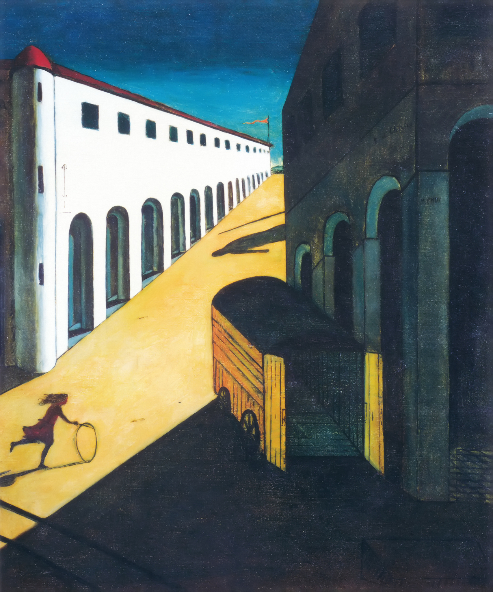

## 基本信息

- 作者：[[契里柯 Giorgio de Chirico]]
- 创作年代：1914
- 材质：布面油画 (*not from wiki*)
- 尺寸：约 87 × 71.5 cm (*not from wiki*)
- 现存地：私人收藏 (*not from wiki*)

## 画面与技法

[[形而上画派 Metaphysical Painting]] 的招牌母题集大成之作：

- 画面左侧**长长的连拱廊**，几乎要通到天边——意向直接来自尼采对都灵广场的描述
- **空无一人的广场**、**废弃的公交车**、**巨人的阴影**（从画框外投入）
- **滚铁圈的小女孩**——对周遭一切的懵然不知

契里柯自述要追求的就是这种"**表面上十分宁静，但给人的感觉却像是在宁静中会有什么事情要发生**"的效果。

画面中什么事都没发生，**观者的心却揪起来了**。

## 图片清单

| 编号 | 出自 | 描述 |
|---|---|---|
| 01 | [[093｜契里柯与恩斯特：如何用绘画表现超现实主义？]] | 远景：左侧白色连拱廊一直延伸到画面深处，右侧绿色货车空敞，前景滚铁圈小女孩剪影，远端投下巨人阴影 |

## 出现在

- [[093｜契里柯与恩斯特：如何用绘画表现超现实主义？]] — 形而上画派的代表作 / 尼采都灵广场的视觉转化
