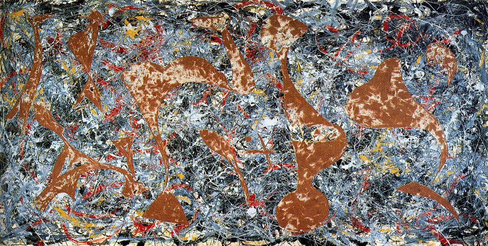

## 基本信息

- 作者: [[波洛克 Jackson Pollock]]
- 创作年代: 1949
- 材质: 板上油彩+瓷釉
- 现存地: (*not from wiki*)

## 画面与技法

> Stub. 097 引为波洛克 1949 年滴画法+割切的实验作。

## 图片清单

| 编号 | 出自 lecture | 描述 |
|---|---|---|
| 01 | [[097｜德·库宁：抽象表现主义追求什么？]] | 全图 |

## 出现在

- [[097｜德·库宁：抽象表现主义追求什么？]]
