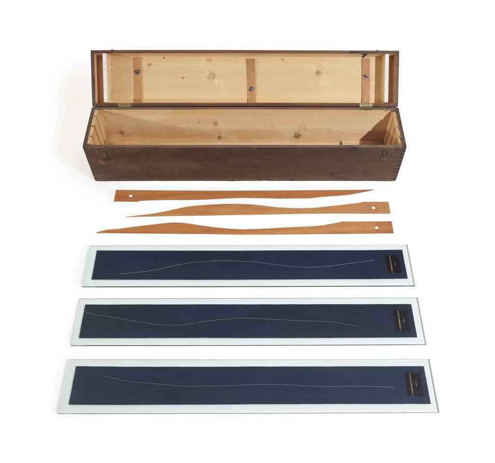

## 基本信息

- 作者：[[杜尚 Marcel Duchamp]]
- 创作年代：1913–1914
- 材质：木盒装置——三段一米长的线落于深蓝色帆布上、固定；配套三块木制曲线标尺 (*not from wiki*)
- 尺寸：木盒 28.2 × 129.2 × 22.7 cm (*not from wiki*)
- 现存地：纽约现代艺术博物馆 (MoMA) (*not from wiki*)

## 画面与技法

操作过程是作品的全部：

1. 把三段各一米长的棉线，分别从一米高度**自由下落**到深蓝色帆布上；
2. 每条线落成什么样子，就用清漆把它固定在那里；
3. 三块帆布裁下、贴到玻璃板上；
4. 同时把每条曲线复制制作成一把**木制曲线标尺**——三把标尺连同三段线一起装进一个木盒。

杜尚的自述目的："**创造出一种长度单位的新形象**"——一米仍然是一米，但形状被偶然决定。

## 画面/概念意义

这是杜尚在 [[啪嗒学 Pataphysics]] 路子上更激进的一次实验——把**[[偶然性 Chance]]** 直接引入艺术创作。他说："20 世纪的艺术越来越变成一个宗教，一个巨大的阴谋……**我从不相信因果关系**，它非常不确定，有着一种令人怀疑的特征。"

与之同步的实验是 1913 年新年和妹妹们把**乐谱剪成 50 条放帽子里随机抽取重组**——后来 1916 苏黎世 [[达达主义 Dadaism]] 把报纸剪碎放袋子里组诗、几年后 [[让·阿尔普 Jean Arp]] 让撕碎的纸自由落在画布上，思路如出一辙。

杜尚此举把"艺术家的创造意志"替换成"自由落体 + 接受偶然"——这是观念艺术诉诸偶然机制的起点。(*not from wiki*)

## 历史背景

(*not from wiki*) 与 [[巧克力研磨机 (杜尚) Chocolate Grinder]] 等共同标志着杜尚正式与"绘画手艺"决裂的过渡期。1913 年他在笔记中写下那句决定一切的话：**"怎么才能做出一件'不算艺术'的作品？"**

## 图片清单

| 编号 | 出自 | 描述 |
|---|---|---|
| 01 | [[090｜杜尚3：他为什么要送一个小便器去参展？]] | 三条线 + 配套木制标尺与木盒 |

## 出现在

- [[090｜杜尚3：他为什么要送一个小便器去参展？]]
