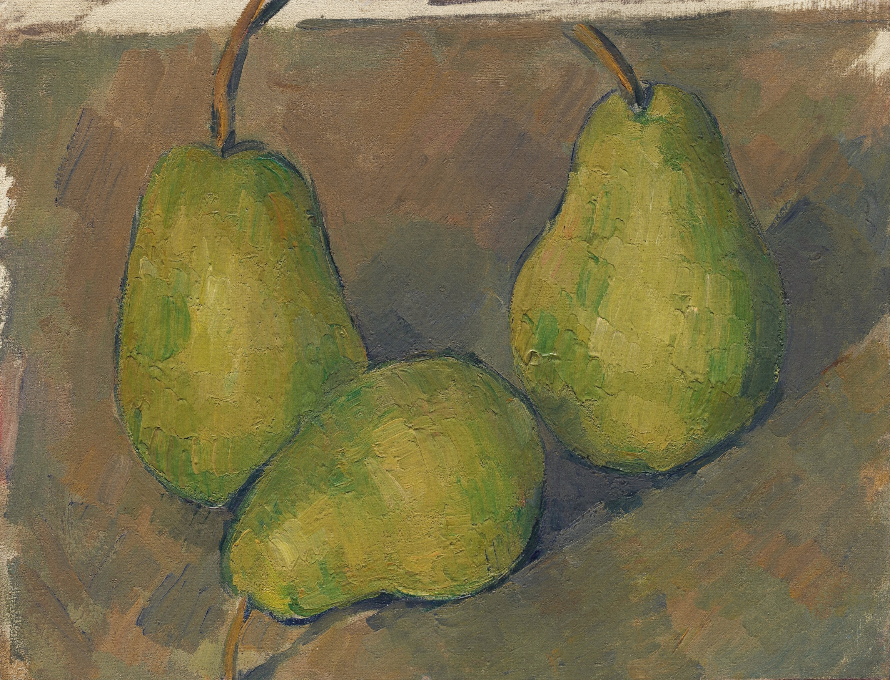

## 基本信息

- 作者：[[塞尚 Paul Cézanne]]
- 创作年代：1878–1879
- 材质：油彩，画布 (*not from wiki*)
- 尺寸：(*not from wiki*) 约 19 × 27 cm（小幅静物）
- 现存地：(*not from wiki*) 美国华盛顿特区国家美术馆 (National Gallery of Art) 等版本流转

## 画面与技法

[[塞尚 Paul Cézanne]] 早期水果静物之一。顾衡 054 把"水果静物"列为塞尚除[[圣维多利亚山 Mont Sainte-Victoire|圣维多利亚山]]之外**做了大量实验的第二个母题**——理由是：

> 静物的好处是它没有故事情节，画家不需要为叙事性分心，可以专心致志地钻研纯形式问题。

操作要点：水果（梨、苹果、橘子、青瓜）被处理为接近球体、圆柱体、圆锥体的几何骨骼，再以[[主观色彩序列 Subjective Colour Sequence|主观色彩序列]]添加肉皮、产生体积感与块面间的呼应关系——是塞尚提出"大自然的形状总是呈现为球体、圆锥体和圆柱体的效果"的实证现场。

## 历史背景 (*not from wiki*)

1870s 末–1880s 初是塞尚从"印象派学徒"过渡到"独立形式实验"的关键期。本作正属此过渡段——色刀厚涂渐退、平行短笔触渐显、几何性意识初露端倪。

## 图片清单

| 编号 | 出自 | 描述 |
|---|---|---|
| 01 | [[054｜塞尚3：为什么理解塞尚那么困难？]] | 全图——早期水果静物 |

## 出现在

- [[054｜塞尚3：为什么理解塞尚那么困难？]] —— 水果静物母题的早期样本
