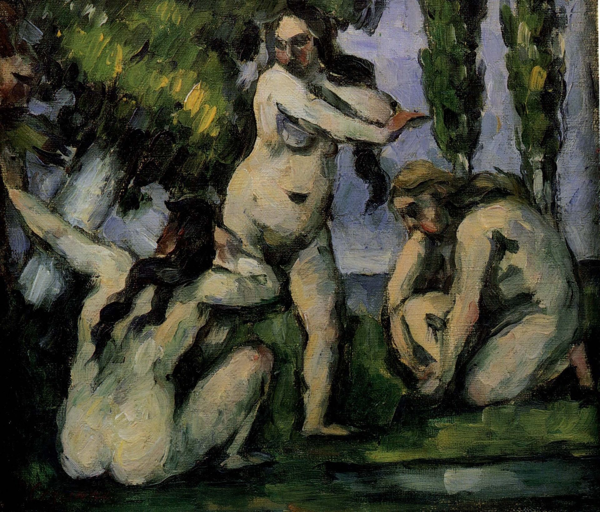
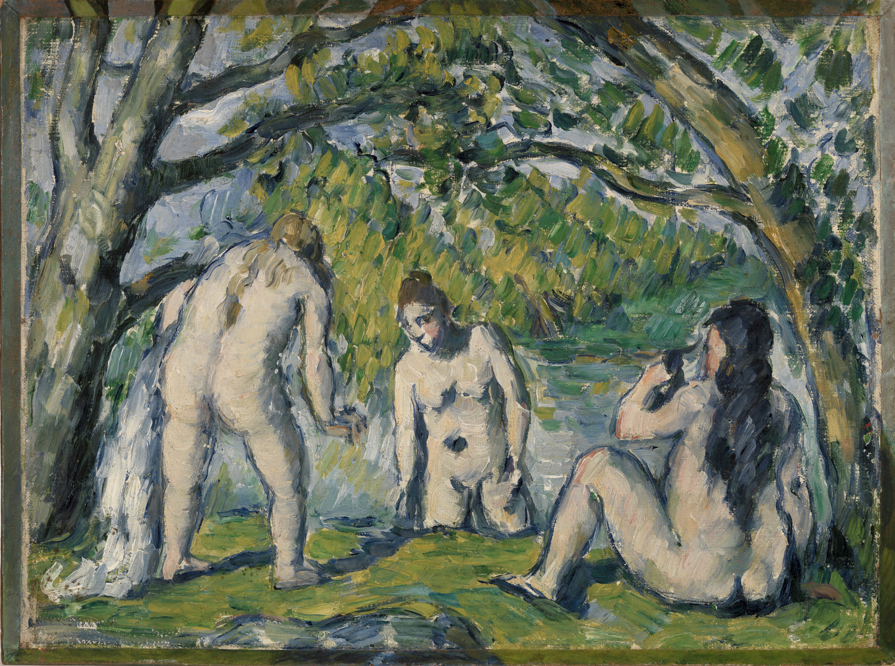

## 基本信息

- 作者：[[塞尚 Paul Cézanne]]
- 创作年代：1874-1875（顾衡 053 标注；塞尚有多幅同题作品 (*not from wiki*)）
- 材质：油彩，画布 (*not from wiki*)
- 尺寸：(*not from wiki*) 约 19.5 × 22 cm（早期小幅）
- 现存地：(*not from wiki*) 法国巴黎小皇宫美术馆 (Petit Palais)

## 画面与技法

[[塞尚 Paul Cézanne]] **"如何在分节块面之间营造纵深"问题的起点**——顾衡 053 用本作引出塞尚拒绝[[线性透视 Linear Perspective|透视法]]后的纵深难题：

- **三个人体有前有后、显然不在一个平面上**
- 左边人体**挡住**了一部分中间人体——**遮蔽**只能解决前后两个体之间的关系
- 但**如何表现右边人体比中间人体处于更深的位置**？这就是**色彩取代透视**的需求来源

塞尚的答案是 [[主观色彩序列 Subjective Colour Sequence]]——"绘画中最重要的事情是找出正确的距离，只有色彩才能表达深度中的所有变化。"（成熟样本见 [[圣维多利亚山 Mont Sainte-Victoire]]）。

## 历史背景 (*not from wiki*)

塞尚一生反复画"浴女"母题——从早期小幅《三个浴女》到晚年巨幅《[[浴女们 The Large Bathers]]》。本 1874-75 小幅是这一系列的起点之一，正值塞尚的"印象派学徒期"。"浴女"母题既呼应 [[安格尔 Jean-Auguste-Dominique Ingres]]《[[瓦平松的浴女 Valpinçon Bather]]》《[[土耳其浴 The Turkish Bath]]》 的学院图式，又被塞尚改造成纯粹的造型练习——人体被简化为色块和几何形。

## 图片清单

| 编号 | 出自 | 描述 |
|---|---|---|
| 01 | [[053｜塞尚2：如何打造艺术的平行世界？]] | 全图——纵深问题的引子 |

## 出现在

- [[053｜塞尚2：如何打造艺术的平行世界？]] —— 引出"如何在分节块面之间营造纵深"的问题
