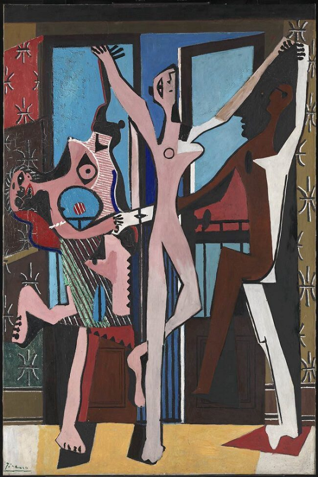

## 基本信息

- 作者：[[毕加索 Pablo Picasso]]
- 创作年代：1925
- 材质：(*not from wiki*) 布面油画
- 尺寸：(*not from wiki*) 215 × 142 cm
- 现存地：(*not from wiki*) Tate Modern, London

## 画面与技法

[[综合立体主义 Synthetic Cubism]] 风格但**人体极度变形夸张**——三个跳舞的女体扭曲、痉挛，远超 1921 年《[[三个音乐家 Three Musicians]]》的克制色块。

**两种解读的对立**：
- 评论家说受**当时盛极一时的 [[超现实主义 Surrealism]] 影响**，反映某种梦境；
- 毕加索的好友与传记作家 [[罗兰特·潘罗斯 Roland Penrose]] 说，毕加索创作此画时**正在忍受不幸婚姻的煎熬**（与 [[奥尔加 Olga Khokhlova]] 关系破裂），内心焦躁——所以画中出现**之前立体主义作品中不曾出现过的东西，就是某种情绪、或者说是情感**。

顾衡 067 用本作论证：立体主义在毕加索这里**从形式实验向情感载体转化**的关键节点。

## 历史背景

(*not from wiki*) 1925 年正值毕加索与 [[奥尔加 Olga Khokhlova]] 的婚姻趋于崩塌；同年布列东 (André Breton) 发表《超现实主义与绘画》一文称毕加索为超现实主义先驱——本作因此被超现实主义阵营广泛挪用为旗帜性作品，但毕加索本人始终拒绝接受这一标签。

## 图片清单

| 编号 | 出自 | 描述 |
|---|---|---|
| 01 | [[067｜毕加索4：什么是综合立体主义？]] | 整体图 |

## 出现在

- [[067｜毕加索4：什么是综合立体主义？]]
