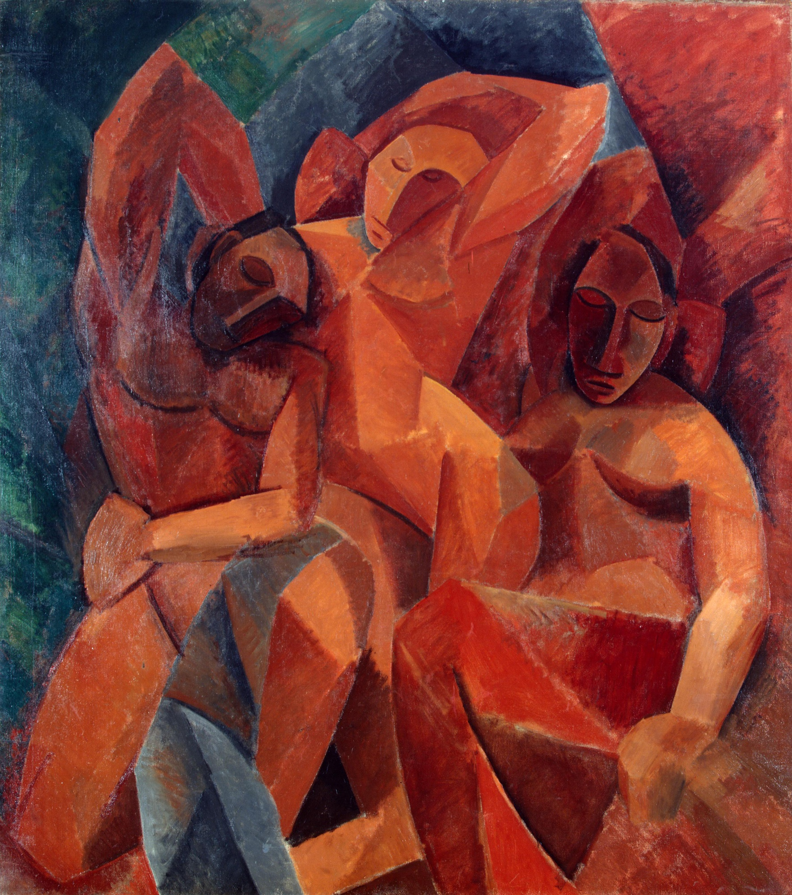

> 注意：勿与 [[三个浴女 Three Bathers]]（[[塞尚 Paul Cézanne]] 1879—1882）混淆——画名相近但作者、年代、风格完全不同。

## 基本信息

- 作者：[[毕加索 Pablo Picasso]]
- 创作年代：1908
- 材质：油彩，画布 (*not from wiki*)
- 尺寸：(*not from wiki*) 约 200 × 178 cm
- 现存地：(*not from wiki*) 圣彼得堡冬宫博物馆 (State Hermitage Museum)

## 画面与技法

[[黑人时期 African Period (Picasso)|黑人时期]] 中期代表作之一——三位女性身体被几何化为圆柱、圆锥、球体的组合，面部呈现非洲木雕的尖颌、深陷眼眶；整体色调以赭红、土褐为主，刻意压低饱和度向**木雕的物质感**靠拢。

顾衡的解读：此作与《[[友谊 Friendship (Picasso)|友谊]]》《[[弹曼陀铃的女人 Woman with a Mandolin (Picasso)|弹曼陀铃的女人]]》《[[穿短上衣的少女 Woman with Yellow Shirt (Picasso)|穿短上衣的少女]]》同属"打着塞尚的旗号画非洲木雕"的样本。

## 历史背景 (*not from wiki*)

也是俄国收藏家 Sergei Shchukin 1908 年从画家手中购入的重要黑人时期画作；与《[[友谊 Friendship (Picasso)|友谊]]》同属冬宫毕加索藏品核心。

## 图片清单

| 编号 | 出自 | 描述 |
|---|---|---|
| 01 | [[065｜毕加索2：如何理解"黑人时期"？]] | 全图——黑人时期中期代表作之一 |

## 出现在

- [[065｜毕加索2：如何理解"黑人时期"？]] —— [[黑人时期 African Period (Picasso)|黑人时期]] 中期代表作
