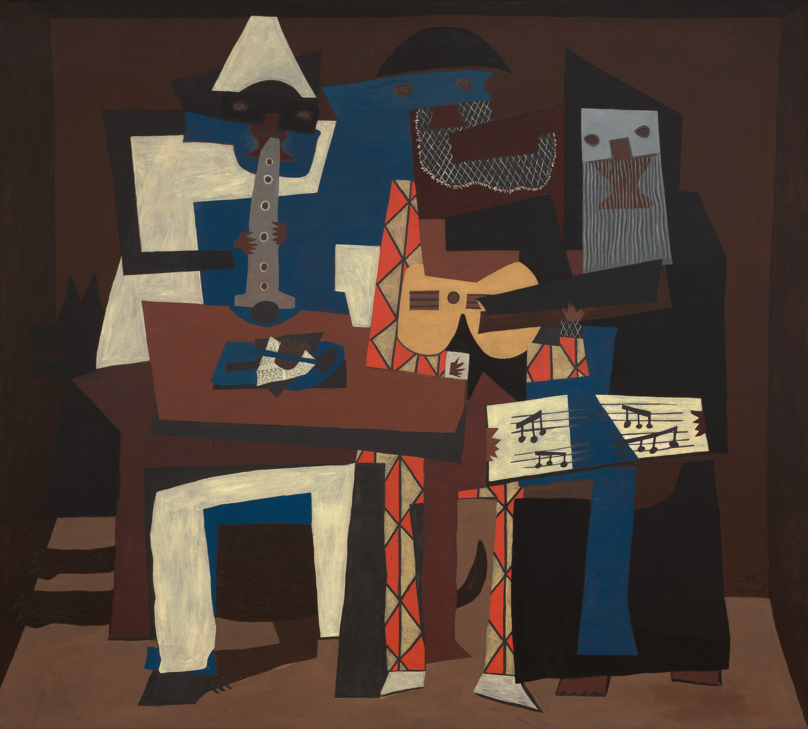

## 基本信息

- 作者：[[毕加索 Pablo Picasso]]
- 创作年代：1921
- 材质：(*not from wiki*) 布面油画
- 尺寸：(*not from wiki*) 200 × 223 cm
- 现存地：(*not from wiki*) Museum of Modern Art (MoMA), New York（同期还有 Philadelphia Museum 一版）

## 画面与技法

[[综合立体主义 Synthetic Cubism]] 的**晚期典范**。画面三个戴面具的乐手：左面 Pierrot（吹单簧管）、中 Harlequin（弹吉他）、右穿僧袍者（唱歌或拿乐谱）——人物由色彩鲜明的几何色块组合而成，**宏观抽象、微观保留乐器与服装细节作为暗示**。

顾衡 067 把它与《[[三个舞蹈家 The Three Dancers]]》并列，作为毕加索一战后"立体主义之理念虽已结束，但其元素与艺术语言被保留"的双样本——**与战前相比更具象一些**，可能与毕加索一战期间向学院派回归有关。

## 历史背景

(*not from wiki*) 1921 年夏，毕加索在 Fontainebleau 创作两幅近似的《三个音乐家》。学界认为画中三个角色对应：Pierrot = 诗人 [[阿波利奈尔 Guillaume Apollinaire]]（已故）、Harlequin = 毕加索本人、僧袍者 = 诗人 [[马科斯·耶科 Max Jacob]]（已退隐修道院）——是对昔日"蒙马特三人组"的纪念。

## 图片清单

| 编号 | 出自 | 描述 |
|---|---|---|
| 01 | [[067｜毕加索4：什么是综合立体主义？]] | 整体图 |

## 出现在

- [[067｜毕加索4：什么是综合立体主义？]]
