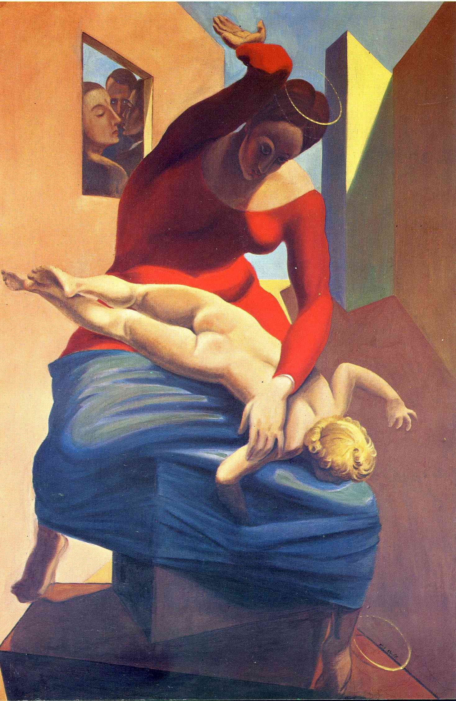

## 基本信息

- 作者：[[恩斯特 Max Ernst]]
- 创作年代：1926
- 材质：布面油画 (*not from wiki*)
- 尺寸：约 196 × 130 cm (*not from wiki*)
- 现存地：科隆路德维希博物馆 Museum Ludwig, Cologne (*not from wiki*)

## 画面与技法

恩斯特"**纯粹的调皮捣蛋**"作品——本课明确把它从恩斯特"诗意路径"严肃序列里拎出来，单独定性为"好玩的"。

画面：圣母玛利亚正在打小基督的屁股；圣婴头顶的光环已掉落在地。三位证人（包括恩斯特本人）从右上角的窗口探头围观——其中一个就是恩斯特自画像 (*not from wiki*)。题材完全反传统宗教画的崇高姿态——是 [[超现实主义 Surrealism]] / [[达达主义 Dadaism]] 反偶像传统的延续。

恩斯特对诗意的追求，使他大部分画"传播上很困难——能看懂的人非常少"。**因此**这种"好玩"的作品在他作品中**实在是太少了**。传播影响力这种庸俗的事情，要由 [[达利 Salvador Dalí]] 来完成。

## 图片清单

| 编号 | 出自 | 描述 |
|---|---|---|
| 01 | [[093｜契里柯与恩斯特：如何用绘画表现超现实主义？]] | 圣母正在打小基督的屁股，光环掉落；画面右上角窗口三位证人探头观看 |

## 出现在

- [[093｜契里柯与恩斯特：如何用绘画表现超现实主义？]] — 恩斯特"纯粹调皮捣蛋"型作品的代表
