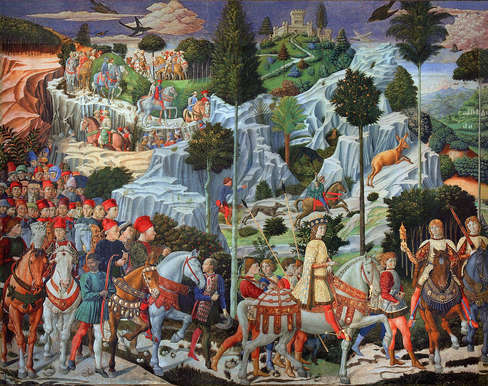

## 基本信息

- 作者：[[戈佐利 Benozzo Gozzoli]]
- 创作年代：1459 (*not from wiki*：实际为 1459–1461)
- 材质：湿壁画 (*not from wiki*)
- 尺寸：礼拜堂三面墙环绕 (*not from wiki*)
- 现存地：佛罗伦萨美第奇-里卡迪宫小礼拜堂 (Cappella dei Magi, Palazzo Medici Riccardi, Florence) (*not from wiki*)

## 画面与技法

题材：东方三博士前来朝拜耶稣的故事——但实际是**美第奇家族 + 佛罗伦萨权贵的真人肖像伪装成宗教游行**，与 [[三博士来朝 (波蒂切利) Adoration of the Magi]] 的"美第奇全家福"操作如出一辙（同样在美第奇资助下）。

**顾衡 037 重点**：

- 创作于 [[马萨乔 Masaccio]]《纳税银》之后 **40 年**——但**景色的真实水平不进反退**
- 远景的山、城堡、骑兵队**画得装饰性十足、不真实**——树是符号化的、山是几何化的
- 顾衡用本作论证：**热衷于使用透视法的佛罗伦萨画家尚且如此**——景色真不真实，他们一点儿都不在乎

## 历史背景

(*not from wiki*) 由 [[科西莫·美第奇]]（老科西莫）委托。礼拜堂正面祭坛画当时是 [[利比修士 Filippo Lippi]] 的《圣母与圣子》——美第奇家族把自己安插进基督教最神圣的来朝场景中，是 [[美第奇家族 Medici Family]] 用艺术做权力宣示的经典案例。

## 图片清单

| 编号 | 出自 | 描述 |
|---|---|---|
| 01 | [[037｜为什么说古典时代没有风景画？]] | 局部，含远景山与城堡 |

## 出现在

- [[037｜为什么说古典时代没有风景画？]]
