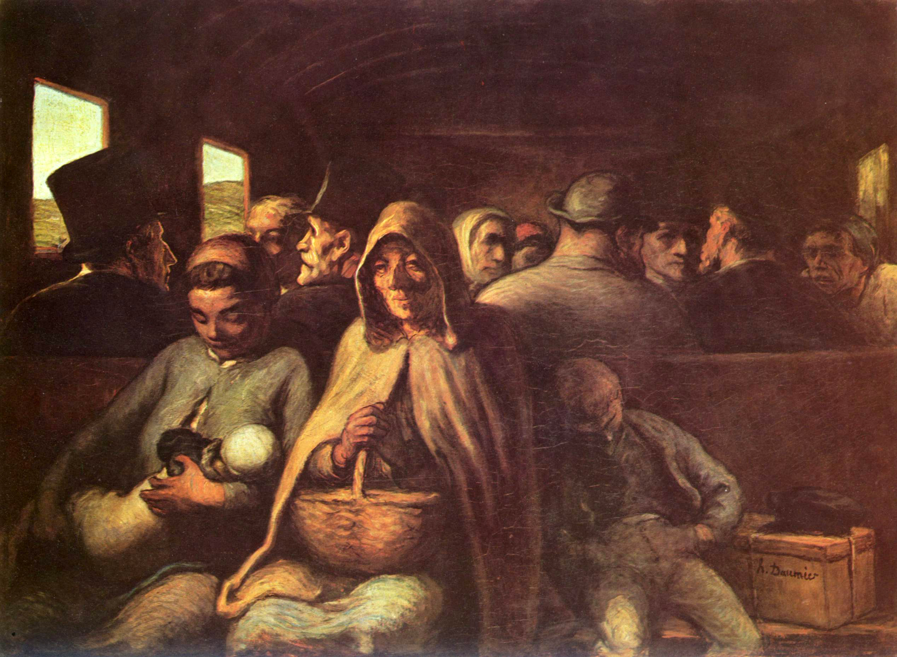

## 基本信息

- **作者**：[[杜米埃 Honoré Daumier]]
- **创作年代**：1862—1864
- **材质**：油画，布面 (*not from wiki*)
- **尺寸**：65.4 × 90.2 cm (*not from wiki*)
- **现存地**：美国纽约大都会博物馆（另有版本在加拿大渥太华国立美术馆、英国伦敦泰特等）(*not from wiki*)

## 画面与技法

(*not from wiki*) 拥挤的三等车厢长椅前排：抱婴年轻母亲、年迈祖母、低头熟睡的男孩——三代女性 + 男孩的"圣家族"式三角；身后挤满无名乘客如沙丁鱼。**没有戏剧、没有故事、没有道德教训**——只有疲惫的日常贫困。杜米埃用**沉浊的褐土色调 + 粗放近 caricature 的轮廓**——他长期画讽刺漫画训练出的"快速捕捉典型"的能力此处升华为悲悯。

## 历史背景 (*not from wiki*)

19 世纪铁路是阶级公开展示的舞台——一等车厢是丝绒包厢，二等是硬座，**三等是无窗木椅敞车**。杜米埃画过一系列车厢主题，本画是最著名一幅。他生前没卖出去，画家死后才被认可。

## 在课程中的角色

顾衡 036 用本画作为**"杜米埃画穷人就犯忌、米勒画穷人就不犯忌"**对照的核心案例。顾衡设问："不比坐在三等车厢里可怜一百倍吗？"——答案在身份：**杜米埃画的是"穷人"（流动的城市无产者），米勒画的是"农民"（本土文化与传统道德的监护人）**。

## 图片清单

| 编号 | 出自 | 描述 |
|---|---|---|
| 01 | [[036｜米勒：什么是"伟大的现实主义"？]] | 全画 |

## 出现在

- [[036｜米勒：什么是"伟大的现实主义"？]] —— 杜米埃"犯忌"案例的核心对照
- [[杜米埃 Honoré Daumier]] —— 代表作
- [[现实主义 Realism]] —— 批判现实主义代表
