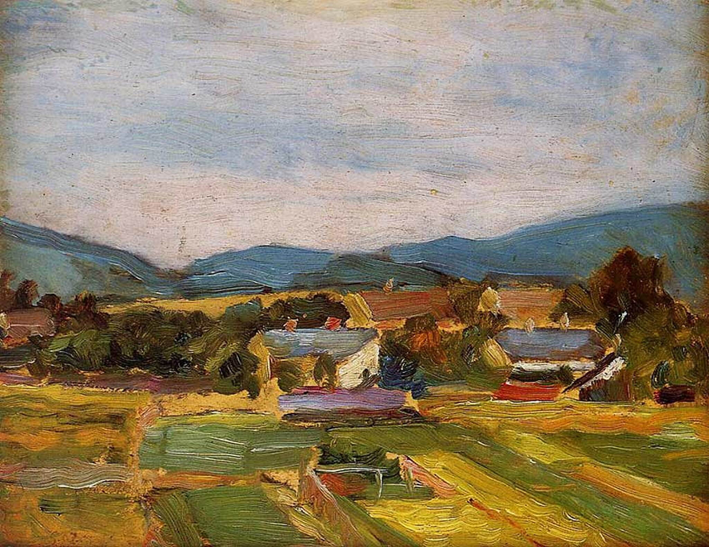

## 基本信息

- 作者：[[席勒 Egon Schiele]]
- 创作年代：1907
- 材质：（*not from wiki*）板上油画
- 尺寸：（*not from wiki*）暂缺
- 现存地：（*not from wiki*）暂缺

## 画面与技法

顾衡 074：**[[后印象派 Post-Impressionism]] 塞尚风格**——色块结构化处理一片下奥地利乡间风景。"他和他学院派的老师（[[格吕彭克尔 Christian Griepenkerl]]）互相不喜欢，也就是可以理解的了。"

## 历史背景 (*not from wiki*)

- 1907 = 席勒拜见 [[克里姆特 Gustav Klimt]] 同一年；这批早期风景画反映了他独立摸索法国新潮流的状态——直到 1907 之后才有"克里姆特推荐 / 弗洛伊德学说"这两条新输入

## 图片清单

| 编号 | 出自 | 描述 |
|---|---|---|
| 01 | [[074｜席勒1：他为什么走向表现主义？]] | 全图 |

## 出现在

- [[074｜席勒1：他为什么走向表现主义？]]
