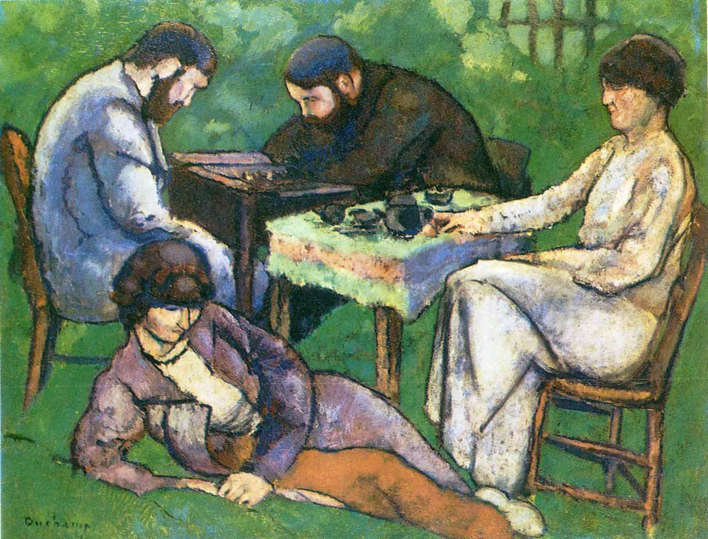

## 基本信息

- 作者：[[杜尚 Marcel Duchamp]]
- 创作年代：1910
- 材质：油画 (*not from wiki*)
- 尺寸：约 114 × 146 cm (*not from wiki*)
- 现存地：费城美术馆 Philadelphia Museum of Art (*not from wiki*)

## 画面与技法

本讲（088）作为杜尚 1910 年"**塞尚期**"代表出场——与《[[艺术家父亲肖像 (杜尚) Portrait of the Artist's Father]]》《[[两个裸女 (杜尚 1910) Two Nudes (Duchamp)]]》并列，受 [[塞尚 Paul Cézanne]] 的影响显而易见。

描绘的是两个哥哥 [[杰克·维庸 Jacques Villon]] 与 [[西蒙·维庸 Raymond Duchamp-Villon]] 在花园棋桌前下棋 (*not from wiki*)，预告了杜尚日后**对国际象棋的痴迷**——他后来"不画画了，专门研究国际象棋，还代表法国去参加世界大赛"。

## 历史背景

(*not from wiki*) 杜尚塞尚期最具代表性的一幅；棋局题材也指向他与两位哥哥（[[皮托集团 Puteaux Group]]的核心）日常生活的写照。

## 图片清单

| 编号 | 出自 | 描述 |
|---|---|---|
| 01 | [[088｜杜尚1：他"好好画画"是什么样子的？]] | 整体图——花园棋桌前两兄弟对弈 |

## 出现在

- [[088｜杜尚1：他"好好画画"是什么样子的？]]
