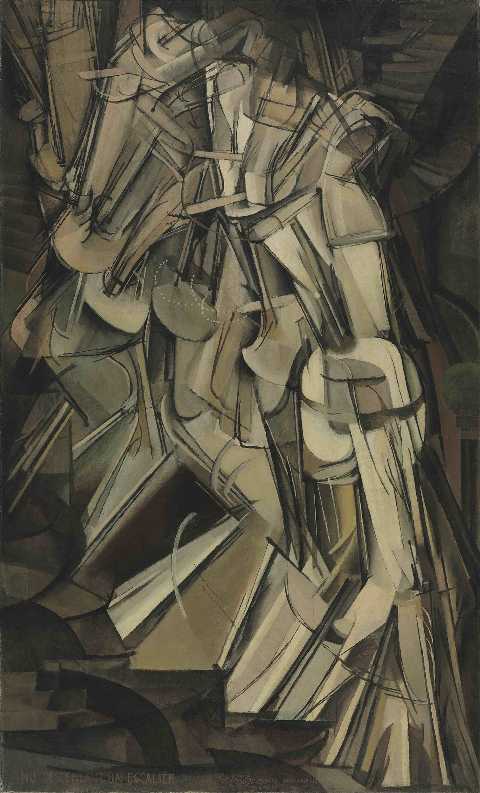
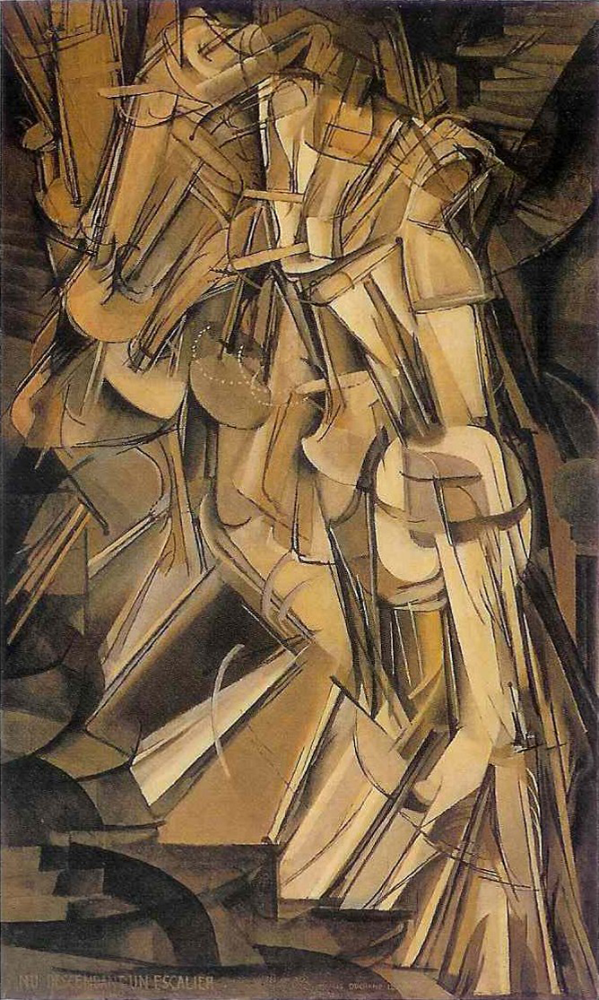

## 基本信息

- 作者：[[杜尚 Marcel Duchamp]]
- 创作年代：1912
- 材质：布面油画 (*not from wiki*)
- 尺寸：147 × 89.2 cm (*not from wiki*)
- 现存地：费城美术馆 (Philadelphia Museum of Art) (*not from wiki*)

## 画面与技法

[[杜尚 Marcel Duchamp]] 把 [[未来主义 Futurism]] "在画面里表现运动"的难题往**文艺复兴之前**捯饬——参照 [[马萨乔 Masaccio]] 的《[[纳税银 The Tribute Money]]》里"把不同时间发生的事情放在一个画面里"的中世纪叙事手法，把**一帧一帧的画面叠到同一幅画里**——一个下楼梯的人形以分解动作的连续残影叠加呈现。

顾衡评："前一幅画我能看懂"（vs 同年的 [[从处女到已婚妇女的过程 The Passage from Virgin to Bride]] 看不出子丑寅卯）。

## 历史背景

(*not from wiki*) 1912 年送展巴黎独立画廊，因"未来主义味道太重"被立体主义阵营退稿；1913 年纽约 Armory Show 展出引发轩然大波。这种"机器分解动作"思路至今影响电影里机器人动作分镜和迈克尔·杰克逊舞蹈。

## 图片清单

| 编号 | 出自 | 描述 |
|---|---|---|
| 01 | [[080｜什么是未来主义？]] | 整体图 |

## 出现在

- [[080｜什么是未来主义？]]
