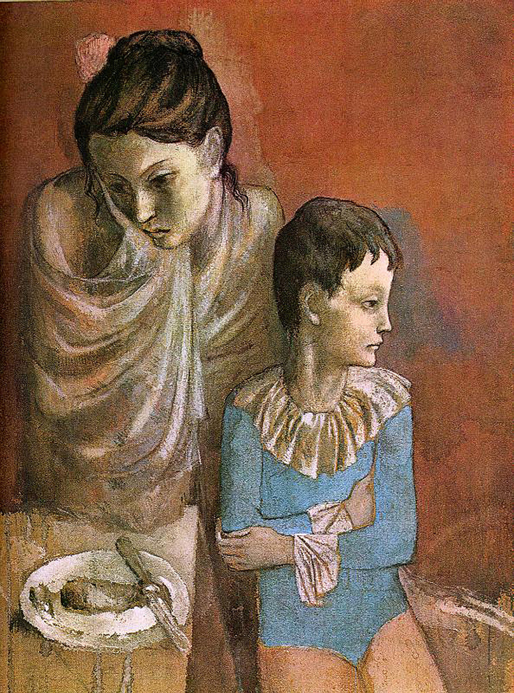

## 基本信息

- 作者：[[毕加索 Pablo Picasso]]
- 创作年代：1905
- 材质：布面油画 / 纸本水粉 (*not from wiki*)
- 尺寸：年代不详 (*not from wiki*)
- 现存地：私人收藏 (*not from wiki*)

## 画面与技法

[[玫瑰红时期 Rose Period]] "强烈同质性"样本——母亲怀抱孩子，两人都拉长瘦削、舞台定格式的表情和动作。色调由 [[蓝色时期 Blue Period]] 的冷蓝换成玫瑰红+灰，但造型语言（[[夏凡纳 Pierre Puvis de Chavannes]] 式简化 + [[埃尔·格列柯 El Greco]] 式拉长 / 舞台定格）完全延续。

本讲（064）以此样本支撑判词："**画面上的人物，有一点点开心的样子吗？**"——没有。色调温暖不等于情绪温暖。

## 历史背景 (*not from wiki*)

- "母与子"题材贯穿毕加索整个艺术生涯，但玫瑰红时期的版本最具图像志辨识度——往往与街头卖艺人 (saltimbanques) 母题并置。

## 图片清单

| 编号 | 出自 | 描述 |
|---|---|---|
| 01 | [[064｜毕加索1：如何理解"蓝色时期"和"玫瑰红时期"？]] | 整幅画面 |

## 出现在

- [[064｜毕加索1：如何理解"蓝色时期"和"玫瑰红时期"？]]
