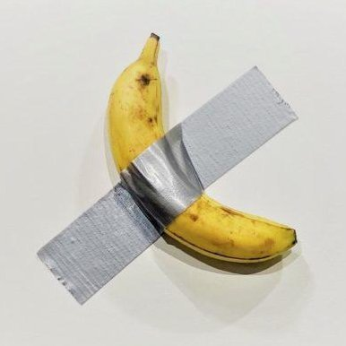

## 基本信息

- 作者：[[卡特兰 Maurizio Cattelan]]
- 创作年代：2019
- 材质：香蕉一只 + 灰色管道胶带（duct tape）
- 售价：2019 迈阿密 Art Basel 一售 12 万美元 (*not from wiki*)
- 现存地：作品包含**"安装指南证书"** + 香蕉可替换——物权属买家、香蕉烂了买家自己换 (*not from wiki*)

## 画面与技法

一根香蕉，用灰色胶带斜十字粘在白墙上。

**事件性 > 物件性**（顾衡 099 核心引）：

- 顾衡："把香蕉粘在墙上，这是艺术。**把人家粘在墙上当艺术品的香蕉吃掉了，这也是艺术**。"
- 2019 年迈阿密首展开幕日，行为艺术家 David Datuna 当众把这根香蕉吃掉，命名其"行为"为 *Hungry Artist*——香蕉立刻被替换、买家完全不在意 (*not from wiki*)。
- 这件作品确证了 [[当代艺术 Contemporary Art]] 的终极状态：**"你有没有留下一件作品，也都变成了无所谓的东西"**——艺术品被压缩为"艺术家在某物上指过一下"这一观念事件。

## 历史背景

(*not from wiki*) 2019 年 12 月 Art Basel Miami Beach 上由 Perrotin 画廊展出，全套作品包含"如何粘贴"的官方证书（藏家凭证书即可在墙上自行重置香蕉与胶带）。三个版本：两件以 12 万美元售出、第三件以 15 万美元成交。被广泛视为 21 世纪 [[当代艺术 Contemporary Art]] 市场炒作与媒体奇观的标志性事件。

## 图片清单

| 编号 | 出自 | 描述 |
|---|---|---|
| 01 | [[099｜大便罐头到NFT：当代艺术的界限在哪里？]] | 灰色胶带斜粘香蕉于白墙 |

## 出现在

- [[099｜大便罐头到NFT：当代艺术的界限在哪里？]]
