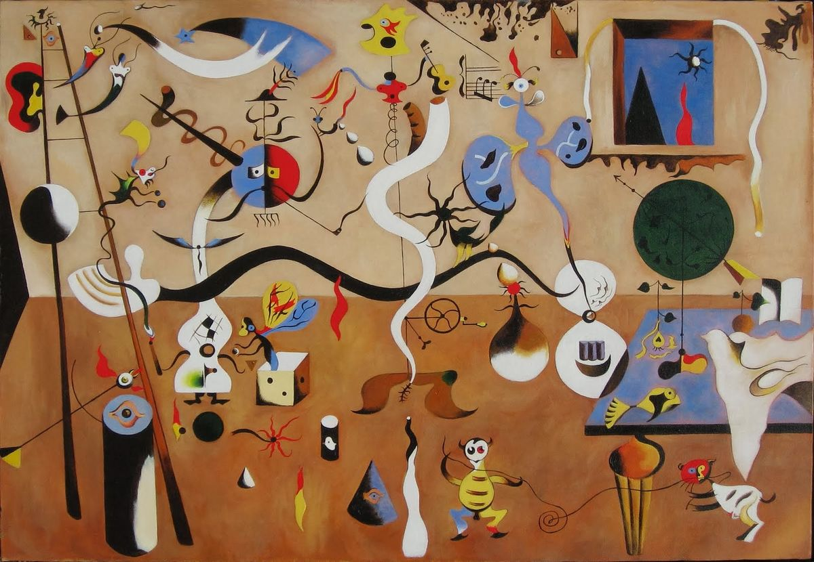

## 基本信息

- 作者：[[米罗 Joan Miró]]
- 创作年代：1924–1925
- 材质：油彩，画布 (*not from wiki*)
- 尺寸：66 × 90.5 cm (*not from wiki*)
- 现存地：奥尔布赖特-诺克斯美术馆 (Albright-Knox Art Gallery)，水牛城 (*not from wiki*)

## 画面与技法

[[米罗 Joan Miró]] 1924–1925 年代表作，超现实主义早期里程碑。画面上**布满大量小型符号、生物、玩具状的形象**——昆虫、星星、音符、丑角、梯子、长着眼睛的鱼……组成一个童稚而梦幻的内部世界。

顾衡 063 把本作放在 [[杜菲 Raoul Dufy]] 的影响链中：

> 与马蒂斯相比，杜菲偏爱让很多小东西充斥着画面，这很符合小孩子的特点。他的作品，对日后超现实主义画家 [[米罗 Joan Miró]] 产生了很大的影响，也就不奇怪了。

——也就是说，[[米罗 Joan Miró]] 这种**画面被大量小符号充斥**的技法，根源可以追溯到 [[杜菲 Raoul Dufy]] 的 [[野兽派 Fauvism]] 装饰传统。

## 历史背景 (*not from wiki*)

- 1924 是超现实主义运动正式发起的年份 (布勒东《超现实主义宣言》)；本作是早期超现实主义视觉语言的奠基性作品之一。
- 米罗自述本作部分形象来源于他当年的饥饿幻觉。

## 图片清单

| 编号 | 出自 | 描述 |
|---|---|---|
| 01 | [[063｜野兽派，除了马蒂斯还能谈什么？]] | 整幅画面——超现实主义里程碑 |

## 出现在

- [[063｜野兽派，除了马蒂斯还能谈什么？]] —— 用以论证杜菲对超现实主义的延伸影响
