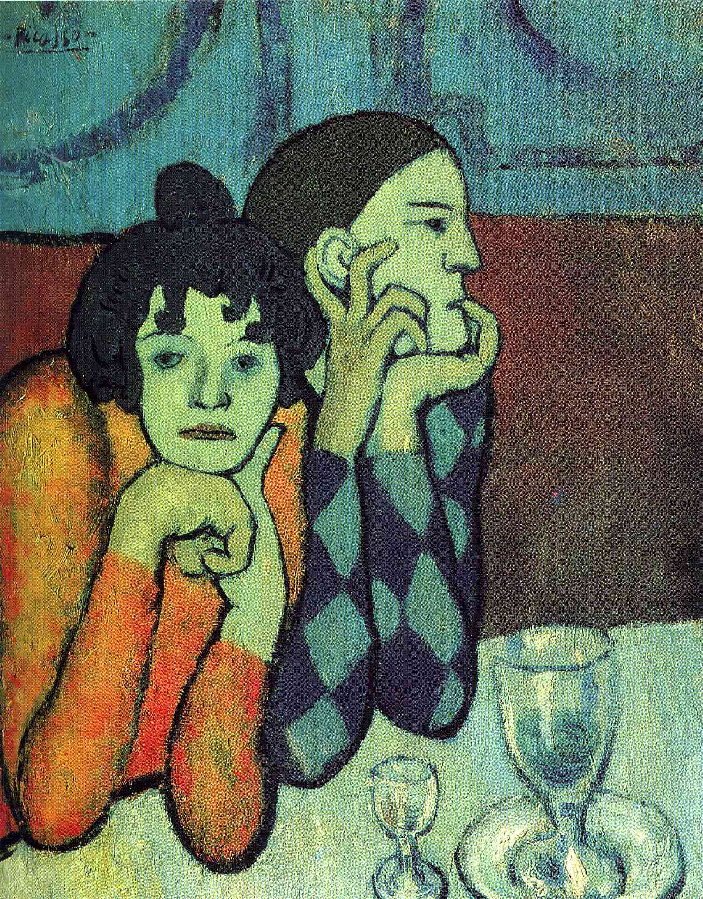

## 基本信息

- 作者：[[毕加索 Pablo Picasso]]
- 创作年代：1901
- 材质：布面油画 (*not from wiki*)
- 尺寸：年代不详 (*not from wiki*)
- 现存地：私人收藏 (*not from wiki*)

## 画面与技法

毕加索 [[蓝色时期 Blue Period]] 初期"兼收并蓄"阶段的作品——本讲判定为 **向 [[高更 Paul Gauguin]] 致敬**：勾边平涂式色域、人物的纪念碑感造型与象征性沉默，都是高更布列塔尼时期与塔希提时期的特征。

街头卖艺人（saltimbanques）题材后续将贯穿毕加索 1904-1906 玫瑰红时期，成为他识别度最高的母题之一。 (*not from wiki*)

## 历史背景 (*not from wiki*)

- 1901 年的毕加索住在巴黎 Clichy 大道附近的小工作室，密集观察蒙马特街头表演者群体。
- 这一题材延续至 [[玫瑰红时期 Rose Period]]，发展出 *Family of Saltimbanques* 等大幅作品。

## 图片清单

| 编号 | 出自 | 描述 |
|---|---|---|
| 01 | [[064｜毕加索1：如何理解"蓝色时期"和"玫瑰红时期"？]] | 整幅画面 |

## 出现在

- [[064｜毕加索1：如何理解"蓝色时期"和"玫瑰红时期"？]]
