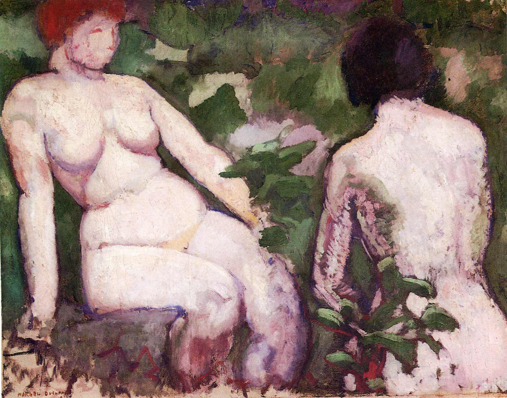

## 基本信息

- 作者：[[杜尚 Marcel Duchamp]]
- 创作年代：1910
- 材质：油画 (*not from wiki*)
- 尺寸：未知
- 现存地：私人收藏 (*not from wiki*)

> 与 [[两个裸女 (Picasso 1906) Two Nudes (Picasso 1906)]] 不同——后者是毕加索原始主义/前立体主义时期的作品；本页是杜尚塞尚期作品。文件名通过 (杜尚 1910) 与 (Picasso 1906) 做歧义消解。

## 画面与技法

本讲（088）作为杜尚 1910 年"**塞尚期**"代表出场——与《[[艺术家父亲肖像 (杜尚) Portrait of the Artist's Father]]》《[[下棋 (杜尚 1910) Chess Game]]》并列，受 [[塞尚 Paul Cézanne]] 影响显而易见。

## 历史背景

(*not from wiki*) 杜尚塞尚期作品；与塞尚的"浴女"系列做对话的姿态。

## 图片清单

| 编号 | 出自 | 描述 |
|---|---|---|
| 01 | [[088｜杜尚1：他"好好画画"是什么样子的？]] | 整体图——塞尚式两裸女 |

## 出现在

- [[088｜杜尚1：他"好好画画"是什么样子的？]]
