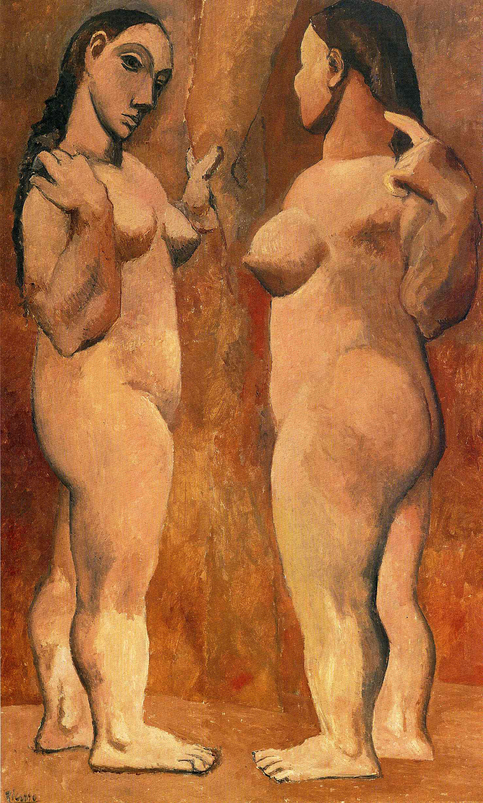

## 基本信息

- 作者：[[毕加索 Pablo Picasso]]
- 创作年代：1906
- 材质：油彩，画布 (*not from wiki*)
- 尺寸：(*not from wiki*) 约 151.3 × 93 cm
- 现存地：(*not from wiki*) 纽约现代艺术博物馆 (MoMA)

## 画面与技法

[[黑人时期 African Period (Picasso)|黑人时期]] **几何化倾向萌芽期**的样本——女性胴体的各个部位开始出现几何化的倾向：胸、腹、肢体被处理成简化的圆柱与球体组合。

色调延续了 [[064｜毕加索1：如何理解"蓝色时期"和"玫瑰红时期"？|玫瑰红时期]] 的肉粉与赭色，但**造型已经从矫饰主义的修长四肢转向几何化的体块**——是从玫瑰红时期向黑人时期的过渡作品。

## 历史背景 (*not from wiki*)

1906 年夏天毕加索在西班牙比利牛斯山的 Gósol 村度假——这段独处催生了一批几何化的女性裸体，是《[[亚威农少女 Les Demoiselles d'Avignon]]》前的"练手"。

## 图片清单

| 编号 | 出自 | 描述 |
|---|---|---|
| 01 | [[065｜毕加索2：如何理解"黑人时期"？]] | 全图——几何化倾向萌芽样本 |

## 出现在

- [[065｜毕加索2：如何理解"黑人时期"？]] —— [[黑人时期 African Period (Picasso)|黑人时期]] 几何化萌芽的样本
