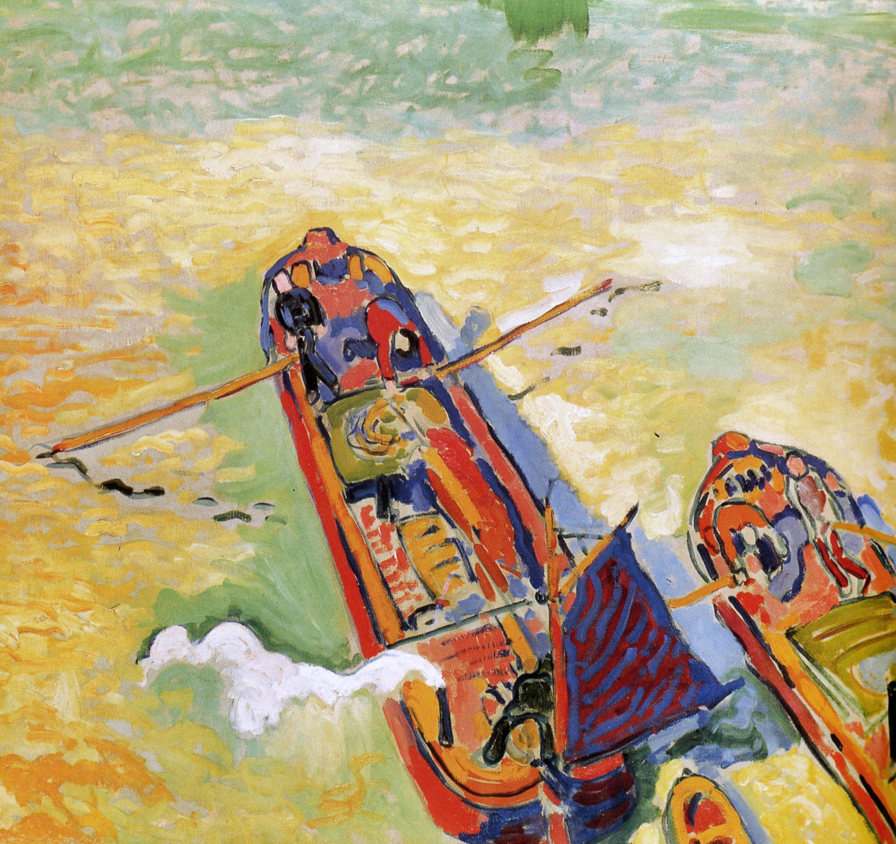

## 基本信息

- 作者：[[德朗 André Derain]]
- 创作年代：1906
- 材质：油彩，画布 (*not from wiki*)
- 现存地：(*not from wiki*)

## 画面与技法

[[德朗 André Derain]] 1906 年作品。顾衡 063 把本作放在 [[德朗 André Derain]] **"很快脱离野兽派、转向表现主义"** 的论述节点——德朗看到了 [[野兽派 Fauvism]] **理论层面的缺陷**：

> 你不可能永远保持一种突然发作的状态。 ——勃拉克

> 我现在不再相信什么色彩组合的和谐了，只有精神才使作品活起来。 ——德朗

色彩相对收敛，开始有表现主义的内省气质。

## 历史背景 (*not from wiki*)

- 1906 是 [[德朗 André Derain]] 风格从 [[野兽派 Fauvism]] 向表现主义/原始主义过渡的拐点年份。
- 顾衡 063 强调：[[德朗 André Derain]] 是野兽派内部**最早觉察理论缺陷的人**——这也是他后来很快转向的内在原因。

## 图片清单

| 编号 | 出自 | 描述 |
|---|---|---|
| 01 | [[063｜野兽派，除了马蒂斯还能谈什么？]] | 整幅画面——德朗转向表现主义的过渡作品 |

## 出现在

- [[063｜野兽派，除了马蒂斯还能谈什么？]] —— 德朗脱离野兽派转向表现主义的样本
