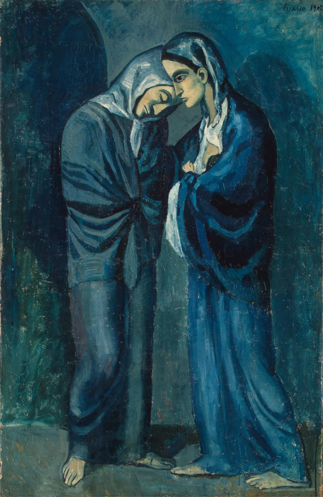

## 基本信息

- 作者：[[毕加索 Pablo Picasso]]
- 创作年代：1902
- 材质：木板油画 (*not from wiki*)
- 尺寸：152 × 100 cm (*not from wiki*)
- 现存地：圣彼得堡冬宫博物馆 (Hermitage Museum) (*not from wiki*)

## 画面与技法

[[蓝色时期 Blue Period]] 定型阶段——本讲列为"强烈同质性"样本之一。两位披斗篷的女子相遇并低头互望，画面被简化到只剩主要人物与空地——是 [[夏凡纳 Pierre Puvis de Chavannes]] 式简化的典型应用。人物造型已显 [[埃尔·格列柯 El Greco]] 式 [[矫饰主义 Mannerism]] 的细长四肢与舞台定格神情。

> 注：与 [[姐妹 (莫利索) The Sisters (Morisot)]] 不可混淆——后者是 1869 年 [[莫利索 Berthe Morisot]] 的印象派作品。 (*not from wiki*)

## 历史背景 (*not from wiki*)

- 创作于巴塞罗那的 Saint-Lazare 监狱（梅毒病房）访问后——画中右侧女子或为监狱中的女病人，左侧为来访的尼姑。
- 是毕加索 1902 年蓝色时期晚期的代表作。

## 图片清单

| 编号 | 出自 | 描述 |
|---|---|---|
| 01 | [[064｜毕加索1：如何理解"蓝色时期"和"玫瑰红时期"？]] | 整幅画面 |

## 出现在

- [[064｜毕加索1：如何理解"蓝色时期"和"玫瑰红时期"？]]
