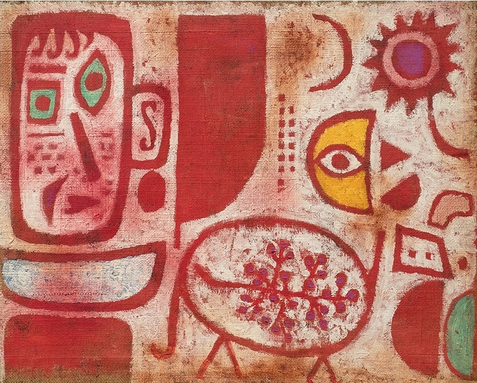

## 基本信息

- 作者：[[克利 Paul Klee]]
- 创作年代：1940
- 材质：油画 (*not from wiki*)
- 现存地：(*not from wiki*)

## 画面与技法

[[克利 Paul Klee]] 临终之年的作品。粗黑线条勾出脸部象形符号，配抹色块，是其晚期符号化肖像范式之一。

## 历史背景

(*not from wiki*) 1940 年克利去世前数月完成。

## 图片清单

| 编号 | 出自 | 描述 |
|---|---|---|
| 01 | [[085｜克利：他为什么模仿小孩子画画？]] | 厚黑笔触的中毒面孔 |

## 出现在

- [[085｜克利：他为什么模仿小孩子画画？]]
