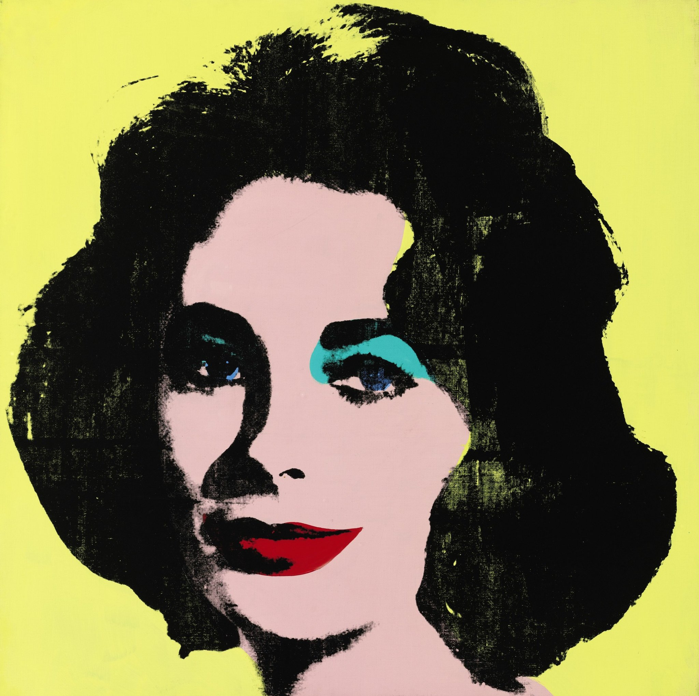

## 基本信息

- 作者：[[安迪·沃霍尔 Andy Warhol]]
- 创作年代：1963
- 材质：[[丝网印刷 Silkscreen]] 于画布
- 尺寸：（*not from wiki*）101.6 × 101.6 cm
- 现存地：（*not from wiki*）私人收藏 / 多家美术馆均藏有同系列其他编号

## 画面与技法

主角是**伊丽莎白·泰勒**（Elizabeth "Liz" Taylor）。沃霍尔从一张明星宣传照切出 Liz 的脸，做 [[丝网印刷 Silkscreen]] 处理——浓重眼影、亮红嘴唇、青绿色眼影、明黄背景——彻底**化妆品广告化**。

延续 [[玛丽莲·梦露 (沃霍尔) Portraits of Marilyn Monroe]] 的逻辑：明星脸——电视里的爆款符号——丝网印刷批量化——画廊。顾衡 098 把它列为沃霍尔代表作之一。

## 历史背景 (*not from wiki*)

- 创作时 Liz Taylor 刚拍完《埃及艳后》（1963），正处于全球曝光顶峰，也正经历重病——和梦露一样，是当时电视上最具流量的明星脸。

## 图片清单

| 编号 | 出自 | 描述 |
|---|---|---|
| 01 | [[098｜波普艺术：流行文化如何成为艺术？]] | 丝网印刷彩色版本 |

## 出现在

- [[098｜波普艺术：流行文化如何成为艺术？]]
