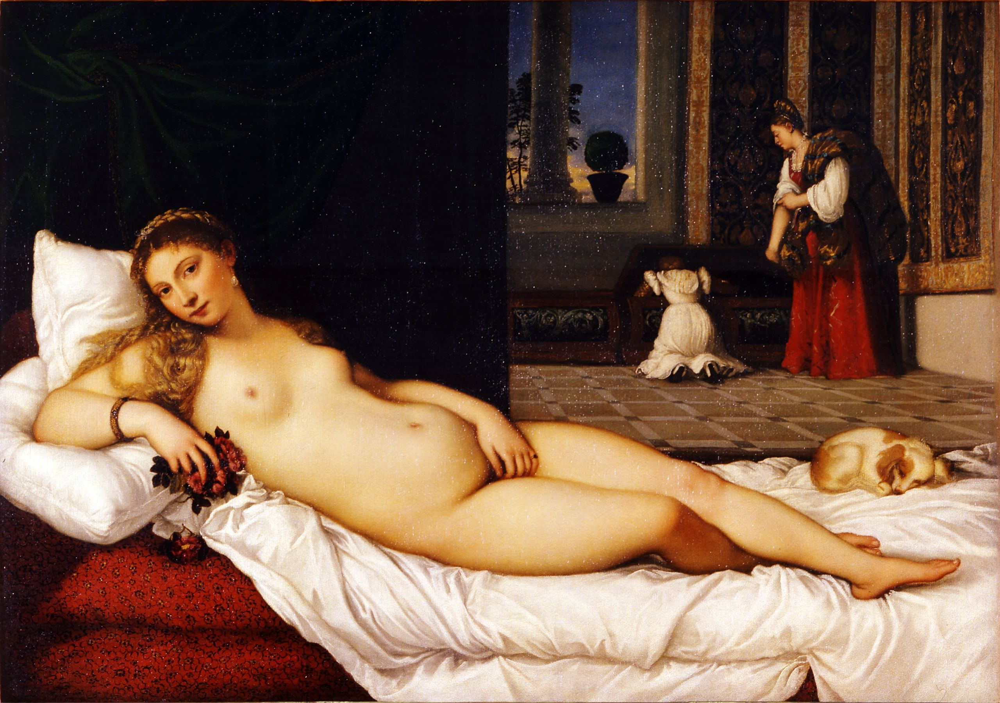
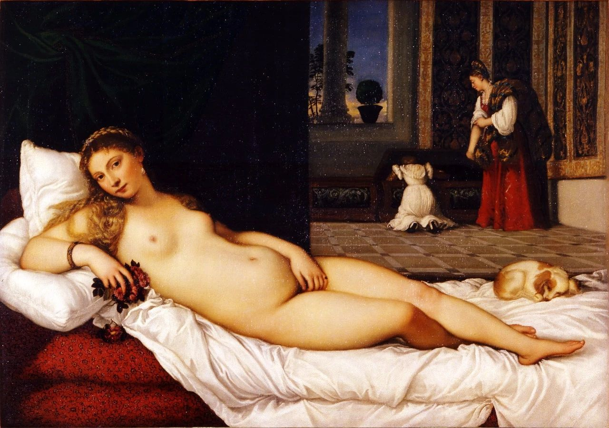

## 基本信息

- 作者：[[提香 Titian]]
- 创作年代：1538
- 材质：布面油画
- 尺寸：119 × 165 cm (*not from wiki*)
- 现存地：佛罗伦萨乌菲齐美术馆 (*not from wiki*)

## 画面与技法

裸女斜躺在床上，左手轻按下体（[[用手遮挡私处母题 Venus pudica]]），眼神**直视观者**。背景由 [[沉睡的维纳斯 Sleeping Venus]] 的户外改成室内：管家与女仆正在从陪嫁箱里给女主人找衣服；脚边小狗安睡。

**顾衡解读**（016）：构图取自师兄乔尔乔内 *Sleeping Venus*，三处关键改造让它从"神画"变成"婚画 + 偷窥邀请"——
1. **嫁妆元素**：画中画出陪嫁，丈夫向女方家庭表敬意——确证这是结婚画，乌尔比诺大公订制挂在新婚卧室。
2. **直视观者**：当时礼节下"直勾勾盯着对方眼睛说话"只有妓女——所以有人主张画的是维纳斯而非妻子。顾衡："女神以妓女形象 vs 妓女假扮维纳斯，是一回事"——结婚卧室挂春宫，意大利常态。
3. **睡狗 = 警报解除**：脚边小狗睡着 = "放心偷窥吧"。

莎拉·杜南特小说《烟花散尽》也说模特是来自罗马的妓女。

## 历史背景

(*not from wiki*) 1538 年为乌尔比诺大公 Guidobaldo della Rovere 订制；19 世纪马克·吐温在游记里愤怒称这是"世界上最污最猥亵的画"。马奈 *Olympia* (1863) 是直接的恶意致敬——把"婚房春宫"换成"赤裸的妓女"，加冕了**现代主义**。

## 图片清单

| 编号 | 出自 | 描述 |
|---|---|---|
| 01 | [[016｜提香：为什么业界评价比达芬奇还高？]] | 整体图 |

## 出现在

- [[016｜提香：为什么业界评价比达芬奇还高？]]
