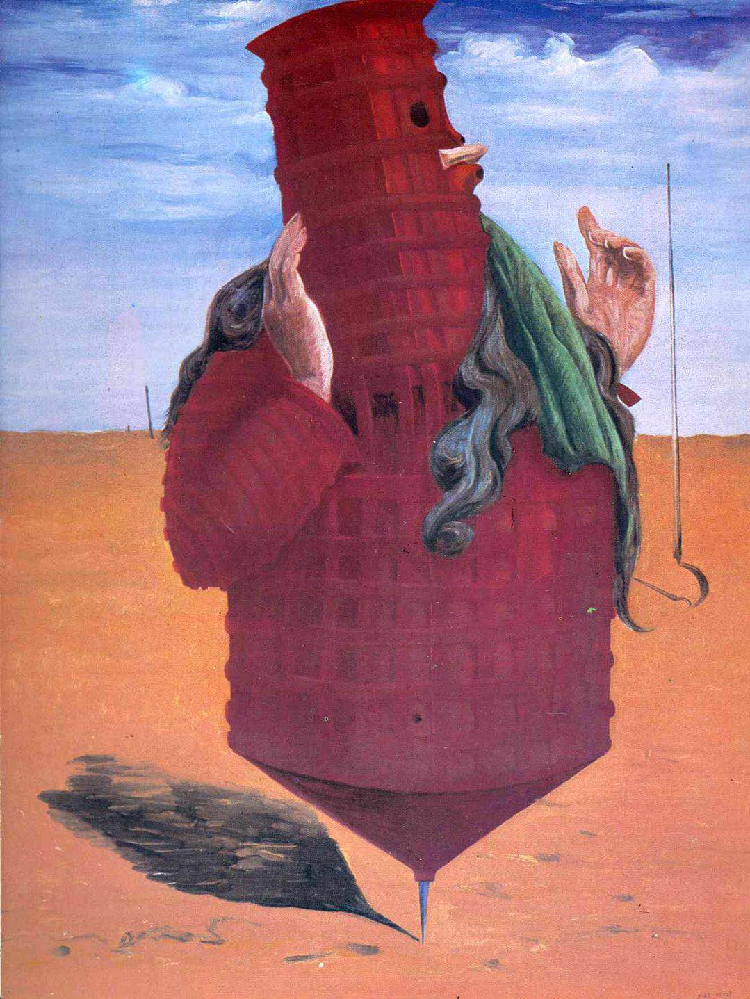
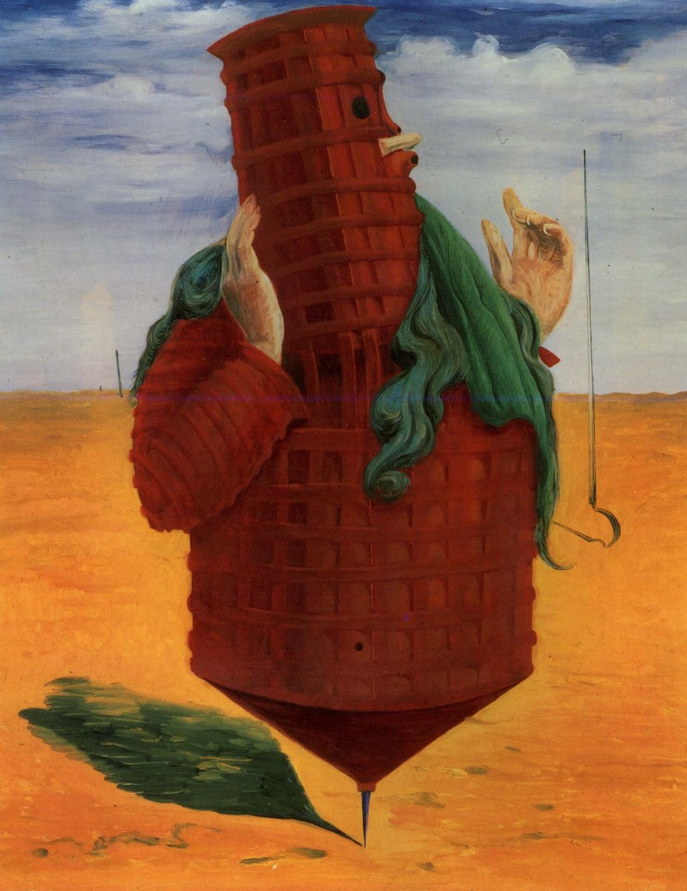

## 基本信息

- 作者：恩斯特 Max Ernst (*not from wiki*；wiki 尚未立人物页)
- 创作年代：1923
- 材质：布面油画 (*not from wiki*)
- 尺寸：(*not from wiki*) 约 100 × 81 cm
- 现存地：(*not from wiki*) 巴黎蓬皮杜中心 Centre Pompidou

## 画面与技法

092 仅以图像形式出现（无独立讨论）——作为 1924 年《[[第一次超现实主义宣言 First Surrealist Manifesto]]》之后的早期**超现实主义绘画样本**列入。

(*not from wiki*) 画面描绘一个**陀螺/纺锤形塔状人物**（拟人化机器与建筑混合体），背景为荒漠透视。题目"Ubu Imperator"取自 [[雅里 Alfred Jarry]]《Ubu Roi 乌布王》（1896 戏剧，[[啪嗒学 Pataphysics]] 源头）。本作把雅里的荒诞角色重构为"机械暴君"——预示 [[超现实主义 Surrealism]] 的偏执狂批评派与梦境派路线。

## 历史背景 (*not from wiki*)

恩斯特从 [[达达主义 Dadaism]] 转入 [[超现实主义 Surrealism]] 的过渡作品之一，比 [[布勒东 André Breton]]《第一次超现实主义宣言》(1924) 早一年。092 把它放在"布勒东已经为超现实主义文学打开闸门，绘画端的恩斯特/马格利特/[[达利 Salvador Dalí]] 正在跟进"的语境下展示。

## 图片清单

| 编号 | 出自 | 描述 |
|---|---|---|
| 01 | [[092｜超现实主义为什么会诞生？]] | 全图——超现实主义早期绘画样本 |

## 出现在

- [[092｜超现实主义为什么会诞生？]]
