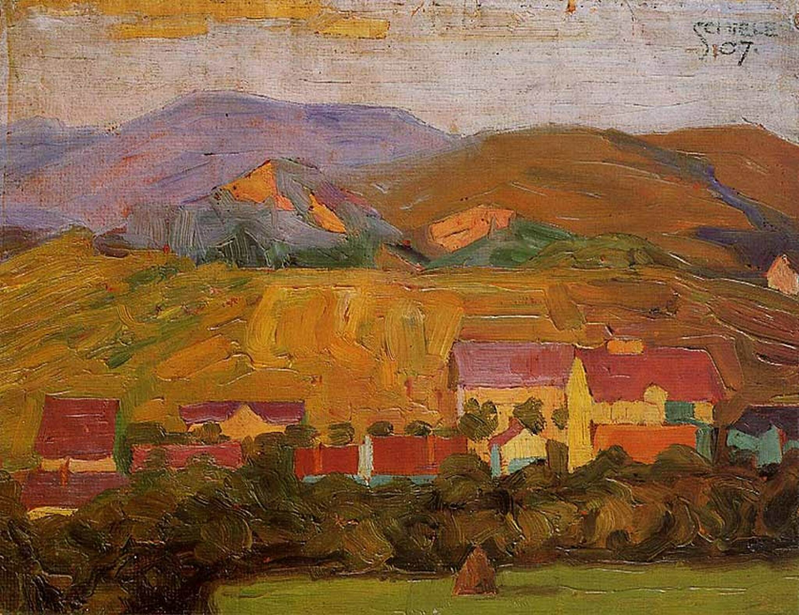

## 基本信息

- 作者：[[席勒 Egon Schiele]]
- 创作年代：1907
- 材质：（*not from wiki*）板上油画
- 尺寸：（*not from wiki*）暂缺
- 现存地：（*not from wiki*）暂缺

## 画面与技法

顾衡 074：**[[后印象派 Post-Impressionism]] 塞尚风格**——色块结构化 / 体积感重于光感。是席勒在维也纳艺术学院期间**绕过导师 [[格吕彭克尔 Christian Griepenkerl]]**、个人摸索法国新潮流的产物之一。

> **同名歧义**：与 [[凡·高 Vincent van Gogh]] 一脉无关；本页是席勒 1907 的板上油画。

## 历史背景 (*not from wiki*)

- 1907 也是席勒**拜见 [[克里姆特 Gustav Klimt]]** 的同一年——风格成形的第一道分水岭年份

## 图片清单

| 编号 | 出自 | 描述 |
|---|---|---|
| 01 | [[074｜席勒1：他为什么走向表现主义？]] | 全图 |

## 出现在

- [[074｜席勒1：他为什么走向表现主义？]]
