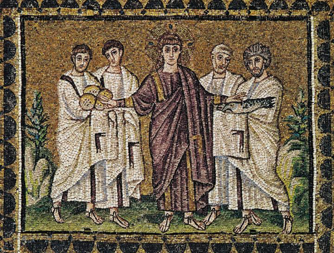

## 基本信息

- 作者：匿名拜占庭镶嵌师
- 创作年代：约 520 (*not from wiki*)
- 材质：墙面 [[马赛克 Mosaic]] (玻璃 + 金箔 tesserae) (*not from wiki*)
- 尺寸：(*not from wiki*) 拉文纳新圣阿波利奈尔教堂中殿上部带状壁面之一格
- 现存地：意大利拉文纳新圣阿波利奈尔教堂 (Basilica di Sant'Apollinare Nuovo, Ravenna) (*not from wiki*)

## 画面与技法

中央是基督，左右两侧各两名门徒。基督手伸向门徒手中托着的两条鱼与五个饼——再现福音书"五饼二鱼喂饱五千人"神迹（马太福音 14:13–21 等）。

形式上：

- **人物无立体感**——但衣褶处理仍能看出希腊衣纹传统的功底；
- **金底**——背景没有空间纵深，只有金色光面；
- **平视角**——所有人物以正面四分之三视角并列；
- **简化、程式化**——基督被画成正中、最高、注视观者，门徒按称名次依排列。

顾衡用它在 [[004｜拜占庭艺术：程式化的艺术是怎么回事？]] 论证："虽然人物没有什么立体感，但是衣褶、衣物与人体的关系，希腊传下来的手艺还是在的——画面虽然幼稚，但和没有技术的小孩绘画是两回事儿。" 这是"不能 vs 不为"论点在拜占庭场景下的具体表达。

## 历史背景

(*not from wiki*) 新圣阿波利奈尔教堂由东哥特国王西奥多里克 (Theodoric the Great, 454–526) 主持建造，他本人是阿利乌斯派基督徒；后来被查士丁尼改宗正统派后，部分马赛克被更替。中殿上部的福音故事带是 520 年代左右完成，本作即其中一格。

## 图片清单

| 编号 | 出自 | 描述 |
|---|---|---|
| 01 | [[004｜拜占庭艺术：程式化的艺术是怎么回事？]] | 整体图 |

## 出现在

- [[004｜拜占庭艺术：程式化的艺术是怎么回事？]]
