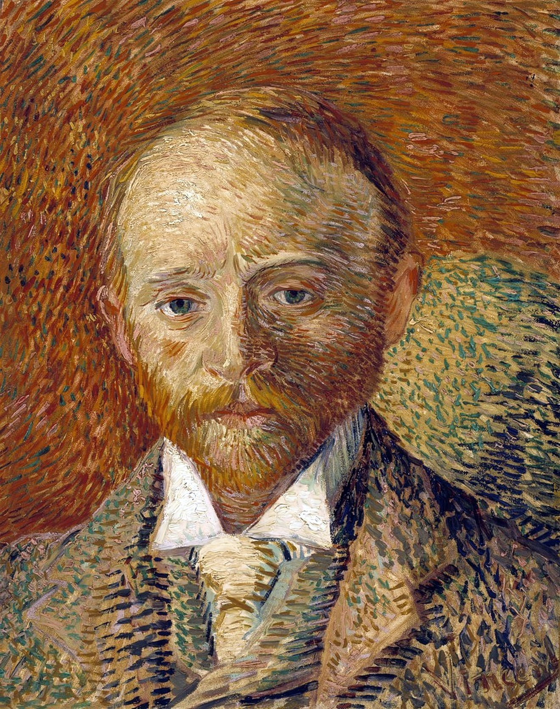

## 基本信息

- 作者：[[凡·高 Vincent van Gogh]]
- 创作年代：1887
- 材质：(*not from wiki*) 卡纸油画
- 尺寸：(*not from wiki*) 41.5 × 33.5 cm
- 现存地：(*not from wiki*) 格拉斯哥 Kelvingrove 美术馆
- 模特：[[亚历山大·里德 Alexander Reid]]——苏格兰画商、凡·高的朋友

## 画面与技法

058 用以举证凡·高的**风格混搭**：

1. **印象派式小笔触**堆积——主体
2. **线条强调轮廓**——在面部、脖颈等关键部位毫不避讳地勾线，使肖像"显得比较结实"
3. **红色背景上"乱点些小点"**——拙劣模仿 [[修拉 Georges Seurat]] 新印象主义的点彩，但既无修拉的耐心也无计算能力——参 [[弹钢琴的女人 Marguerite Gachet at the Piano]] 与 [[西涅克 Paul Signac]] 的劝退轶事

顾衡 058 总结：凡·高对新印象主义的理解和使用也同样是"以我为主"的——这同时是他风格难以归类的核心原因。

## 历史背景 (*not from wiki*)

亚历山大·里德 1887 年到巴黎，与凡·高合住一段时间，两人长相相似，被同时代人误认为兄弟。提奥与里德同在画商圈活动。里德后来回苏格兰创立画廊，将印象派、后印象派作品带入英国——是后印象派早期国际化的关键人物。

## 图片清单

| 编号 | 出自 | 描述 |
|---|---|---|
| 01 | [[058｜凡·高2：为什么他的风格难以界定？]] | 整幅画作，小笔触+线条+点彩三合一 |

## 出现在

- [[058｜凡·高2：为什么他的风格难以界定？]]
