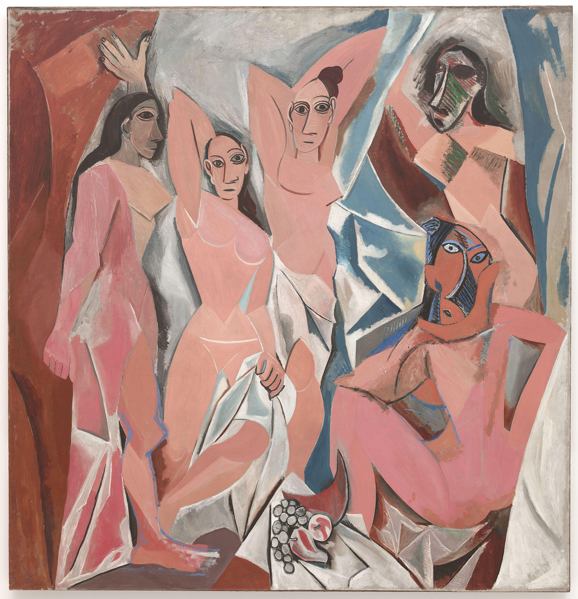

## 基本信息

- 作者：[[毕加索 Pablo Picasso]]
- 创作年代：1907
- 材质：油彩，画布 (*not from wiki*)
- 尺寸：244 × 233 cm（顾衡课文给出）
- 现存地：(*not from wiki*) 纽约现代艺术博物馆 (MoMA)

## 画面与技法

[[黑人时期 African Period (Picasso)|黑人时期]] 的**爆发点**——也是 20 世纪西方艺术史的核心转折之一。

**构图血缘**：自来于 [[埃尔·格列柯 El Greco]] 的《[[揭开第五封印 The Opening of the Fifth Seal|揭开第五封印]]》——格列柯画面深处的 [[美惠三女神 Three Graces|美惠三女神]] 被毕加索移到**前景**中、变身为搔首弄姿的妓女。

**初稿改动**：原稿中有两个男人——一个是嫖客，一个是手持骷髅头、对嫖客进行警示的医生（典型的 [[Vanitas Vanitas|memento mori]]/警世构图）；后来毕加索觉得只画女人表现力更强，**把两个男人抹掉**。

**五位人物的差异化处理**：

- **最左女子**：侧面对着我们但**眼睛是正面**的——明显模仿[[古埃及艺术 Ancient Egyptian Art|古埃及绘画]]的"侧面身体+正面眼睛"程式。
- **中间两位**：脸庞和眼睛的形状复用[[格特鲁德·斯坦因肖像 Portrait of Gertrude Stein|斯坦因肖像]]的程式化处理（鼻子歪、面具感强）。
- **右边两位**：**完全是非洲木雕的风格**——锋利的对角线、纵向条纹的"刀痕"，对非洲面具的直接抄袭。

**与塞尚的关系**：表面上是 [[塞尚 Paul Cézanne]] 式几何拼接——你看，不都是几何图形拼出来的吗？但顾衡指出：[[塞尚 Paul Cézanne]] 把几何当**起点**，要"加皮加肉"走回现实（[[结晶 (塞尚) Crystallization]]）；毕加索是**字面理解**——其实**把塞尚苦心建立的体系拆成废墟**。

**对古埃及与非洲艺术的"直接抄袭式引用"**：自 [[马奈 Édouard Manet]]、[[印象派 Impressionism]] 以来西方画家就借鉴日本艺术，[[高更 Paul Gauguin]] 和 [[马蒂斯 Henri Matisse]] 借鉴更明显——**但都是把外来艺术作为养分加进西方体系**。毕加索的本画**把西方绘画语言全都抛到九霄云外**。

## 历史背景 (*not from wiki*)

- "亚威农 (Avignon)" 指巴塞罗那的**Carrer d'Avinyó 街**——巴塞罗那红灯区的一条街，而非法国南部教皇城阿维尼翁。
- 画作完成后**被毕加索雪藏 30 年**——只有少数朋友看过；画商 [[卡恩韦勒 Daniel-Henry Kahnweiler]] 出价收购被拒。
- **1937 年**毕加索功成名就后才首次公开展览。
- **1939 年** MoMA 收购，成为该馆镇馆之宝之一，奠定毕加索作为 20 世纪现代艺术**创派人**的地位。
- 历史地位：被广泛视为**立体主义的预告 / 现代艺术的开端**（虽然顾衡反对此说，认为黑人时期与立体主义无逻辑联系）。

## 当代评价

| 人 | 评价 |
|---|---|
| [[德朗 André Derain]] | "他迟早会把自己吊死在这块画布后面。" |
| 利奥·斯坦因（[[格特鲁德·斯坦因 Gertrude Stein]] 的哥哥） | 毕加索为了搏出位真是脸都不要了。 |
| [[马蒂斯 Henri Matisse]] | 这是对整个西方艺术和文化的一次暴行。 |
| [[勃拉克 Georges Braque]] | "这就好像是在说我们应该换换口味，然后要求我们今后吃石蜡和木屑。" |

## 图片清单

| 编号 | 出自 | 描述 |
|---|---|---|
| 01 | [[065｜毕加索2：如何理解"黑人时期"？]] | 全图——黑人时期的爆发点、20 世纪现代艺术的转折性画作 |

## 出现在

- [[065｜毕加索2：如何理解"黑人时期"？]] —— [[黑人时期 African Period (Picasso)|黑人时期]] 的代表作
