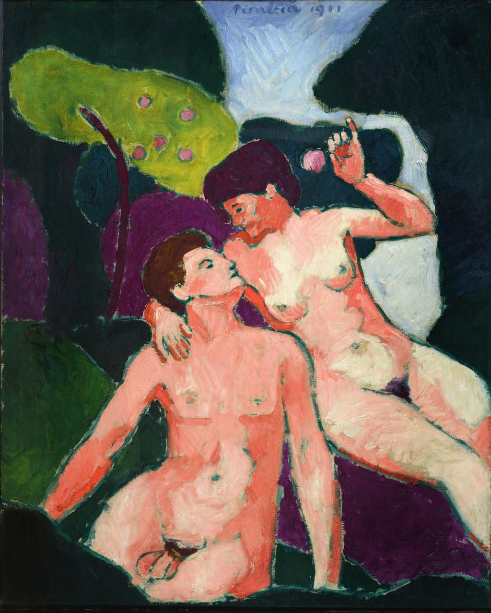

## 基本信息

- 作者：[[毕卡比亚 Francis Picabia]]
- 创作年代：1911
- 材质：布面油画 (*not from wiki*)
- 尺寸：年代不详 (*not from wiki*)
- 现存地：私人收藏 (*not from wiki*)

## 画面与技法

[[毕卡比亚 Francis Picabia]] 1911 年作品，与 [[杜尚 Marcel Duchamp]] 同时期《[[穿黑丝袜的裸女 (杜尚) Nude with Black Stockings]]》"**如出一辙**"——都是**加了黑线条勾边**、**[[高更 Paul Gauguin]] + [[马蒂斯 Henri Matisse]] 混搭的风格**。这是两人相识 (1910) 后第一年作品风格高度同步的证据。

## 历史背景

(*not from wiki*) 1910 年毕卡比亚与杜尚相识；杜尚立即爱上毕卡比亚的妻子 [[加布里埃尔·布菲 Gabriële Buffet-Picabia]]，三人组成的小圈子使两人绘画进入"同步期"。

## 图片清单

| 编号 | 出自 | 描述 |
|---|---|---|
| 01 | [[091｜毕卡比亚：如何用绘画表现达达主义？]] | 整体图 — 高更 + 马蒂斯混搭，黑线勾边 |

## 出现在

- [[091｜毕卡比亚：如何用绘画表现达达主义？]]
