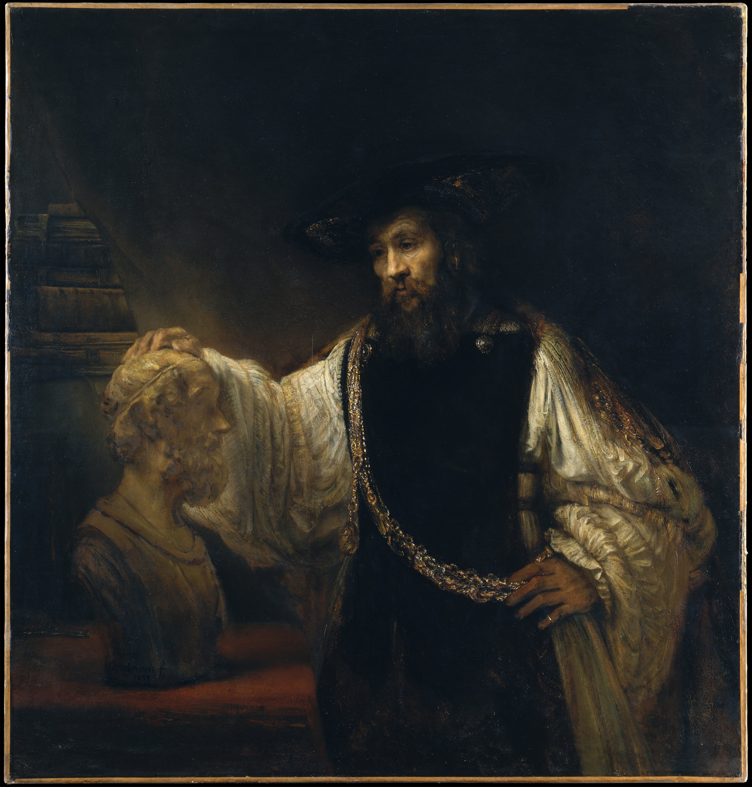

## 基本信息

- 作者：[[伦勃朗 Rembrandt]]
- 创作年代：1653
- 材质：布面油画 (*not from wiki*)
- 尺寸：约 143.5 × 136.5 cm (*not from wiki*)
- 现存地：纽约大都会艺术博物馆 The Met (*not from wiki*)
- 订主：西西里贵族 Don Antonio Ruffo (*not from wiki*)

## 画面与技法

本课用以**演示 [[厚涂 Impasto]] 极致**的两幅画之一（另一幅是同期的《[[戴金盔的男子 Man with the Golden Helmet]]》）。

- 亚里士多德金链与衣物的金色刺绣、荷马胸像的大理石质感——都是伦勃朗高光处用**刮刀**乃至**手指**代替画笔的产物，最厚处颜料厚度可达 **2 cm 多**
- **颜料堆积本身即是质感** —— 不再依赖逼真的轮廓与渐变，而是颜料的物理厚度直接化为衣物 / 金属 / 大理石的视觉重量
- 伦勃朗一再嘱咐客户：**把作品放在强光下、并站得远一点再看**——这种厚涂画法在近距离下会看见"未完成感"，但远观下质感与体积感才能真正显现

## 历史背景

(*not from wiki*) 1653 完成，西西里贵族 Don Antonio Ruffo 远程订件。Ruffo 后又向伦勃朗订了《亚历山大》《荷马口授》，构成"哲人三联"。本作 1961 年由大都会以**当时创纪录价 230 万美元**购入，是 20 世纪艺术市场的标志性事件。

## 图片清单

| 编号 | 出自 | 描述 |
|---|---|---|
| 01 | [[025｜伦勃朗1：为什么他被称为荷兰最伟大的画家？]] | 整体 |

## 出现在

- [[025｜伦勃朗1：为什么他被称为荷兰最伟大的画家？]]
