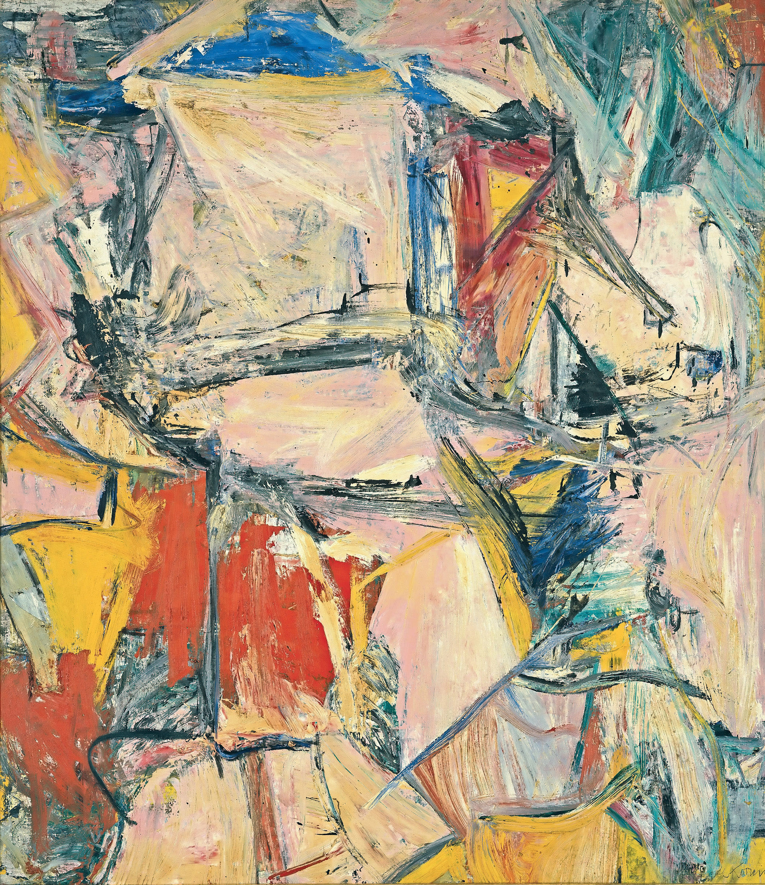

## 基本信息

- 作者：[[德·库宁 Willem de Kooning]]
- 创作年代：1955
- 材质：布面油画 (*not from wiki*)
- 尺寸：约 200.7 × 175.3 cm (*not from wiki*)
- 现存地：私人收藏（Kenneth C. Griffin，2015 年以 3 亿美元购入，曾创下油画成交价纪录）(*not from wiki*)

## 画面与技法

德·库宁抽象表现主义阶段的**行动绘画**代表作。本讲（097）作为德·库宁画面"足够抽象、足够无序，但每一笔都饱含情感张力"的代表案例出现。画面上保留画架与画笔——颜料层层堆叠刮抹——可隐约辨识出女性身体或风景的母题，但整体已被推到接近完全抽象。

## 图片清单

| 编号 | 出自 | 描述 |
|---|---|---|
| 01 | [[097｜德·库宁：抽象表现主义追求什么？]] | 暖橙、粉红与靛蓝交织的色块；笔触粗暴、刮抹痕迹明显 |

## 出现在

- [[097｜德·库宁：抽象表现主义追求什么？]] — 抽象表现主义阶段代表
