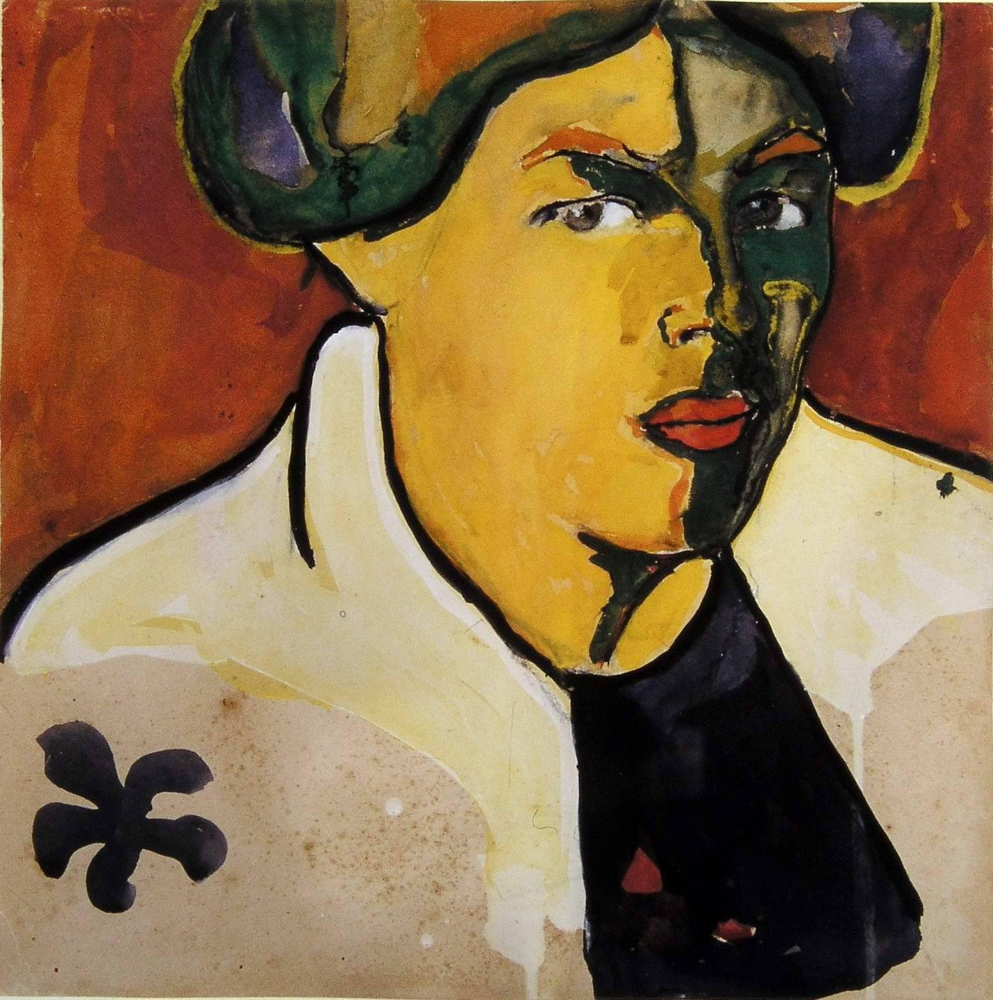

## 基本信息

- 作者：[[马列维奇 Kazimir Malevich]]
- 创作年代：1910
- 材质：布面油画 (*not from wiki*)
- 尺寸：年代不详 (*not from wiki*)
- 现存地：私人收藏 (*not from wiki*)

## 画面与技法

顾衡 083 评本作"简直就是在向马蒂斯的《[[绿线 Madame Matisse with Green Stripes|绿线]]》致敬"——同样的纵向**绿色色带**纵分人脸、左黄绿右粉红，是 [[马列维奇 Kazimir Malevich]] 进入 [[野兽派 Fauvism]] 时期的样本。

## 图片清单

| 编号 | 出自 | 描述 |
|---|---|---|
| 01 | [[083｜马列维奇：什么是至上主义？]] | 全画 |

## 出现在

- [[083｜马列维奇：什么是至上主义？]]
