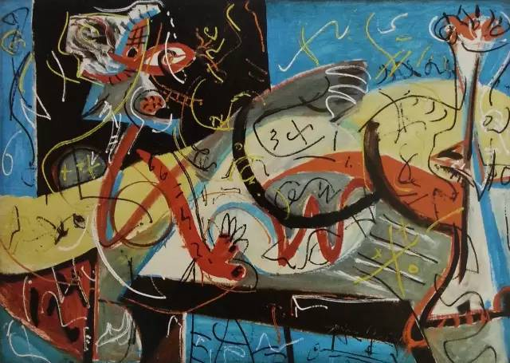

## 基本信息

- 作者：[[波洛克 Jackson Pollock]]
- 创作年代：1942
- 材质：(*not from wiki*)
- 尺寸：(*not from wiki*)
- 现存地：纽约现代艺术博物馆 MoMA (*not from wiki*)

## 画面与技法

波洛克 1942 年的关键作品——在 [[佩姬·古根海姆 Peggy Guggenheim]] 主办的 35 岁以下美国年轻画家比赛上送审。佩姬本想"枪毙掉"，但评委 [[蒙德里安 Piet Mondrian]] 力挺："这是我来美国后见过的最有意思的东西了。这个人你可得盯紧了。" 此画直接促成佩姬与波洛克 1943 年签约。

## 历史背景 (*not from wiki*)

1942 年 [[WPA]] 停发，本土艺术家断粮；佩姬开始组织美国本土年轻画家比赛与签约。蒙德里安那时刚到纽约不久。

## 图片清单

| 编号 | 出自 | 描述 |
|---|---|---|
| 01 | [[096｜波洛克：什么是当代艺术的第一个流派？]] | 人物速写 Stenographic Figure (1942) |

## 出现在

- [[096｜波洛克：什么是当代艺术的第一个流派？]]
