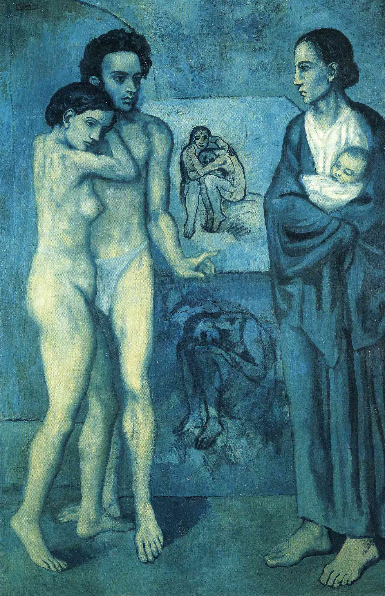

## 基本信息

- 作者：[[毕加索 Pablo Picasso]]
- 创作年代：1903
- 材质：布面油画 (*not from wiki*)
- 尺寸：196.5 × 129.2 cm (*not from wiki*)
- 现存地：克利夫兰艺术博物馆 (Cleveland Museum of Art) (*not from wiki*)

## 画面与技法

[[毕加索 Pablo Picasso]] [[蓝色时期 Blue Period]] **最重要、最大尺幅的作品**——本讲列为"强烈同质性"五样本之一。左侧裸体男女（男子手指向右）、右侧抱婴妇女对望，背后是两幅画中画（蜷缩的赤裸人物）。寓意被广泛阅读为生命的连续与人际关系的悲剧性。 (*not from wiki*)

风格特征：

- **[[夏凡纳 Pierre Puvis de Chavannes]] 式简化**——背景退至空白、构图剧场化。
- **[[埃尔·格列柯 El Greco]] 式 [[矫饰主义 Mannerism]]**——拉长四肢与"舞台定格式动作神情"——尤以右侧母亲与左侧男子的姿态最明显。
- 单色调蓝绿色饱和。

英文标题常作 *Life*——本讲 caption 即 "人生 Life"。

## 历史背景 (*not from wiki*)

- 题材与毕加索同乡好友 **Carlos Casagemas** 1901 年的自杀有关——左侧男子被研究者认作 Casagemas 的纪念性肖像。
- X 射线显示画下原本是 1901 年毕加索的一幅自画像。
- 是蓝色时期定型阶段最大胆的"宏大主题"尝试，但顾衡判定本质仍是夏凡纳+格列柯杂交。

## 图片清单

| 编号 | 出自 | 描述 |
|---|---|---|
| 01 | [[064｜毕加索1：如何理解"蓝色时期"和"玫瑰红时期"？]] | 整幅画面 |

## 出现在

- [[064｜毕加索1：如何理解"蓝色时期"和"玫瑰红时期"？]]
