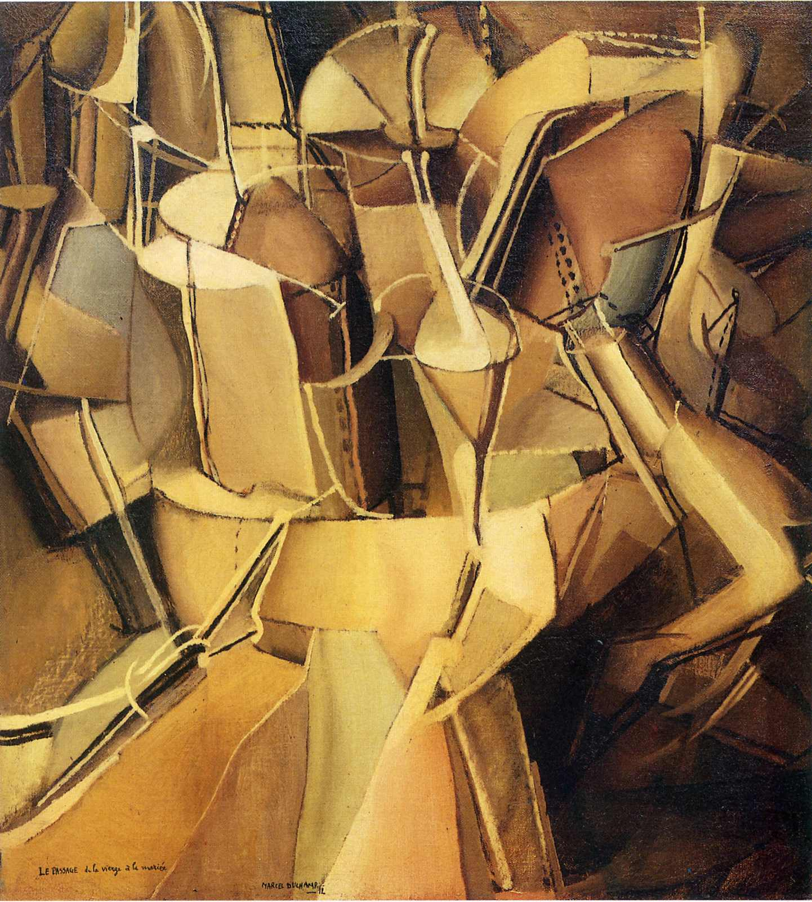
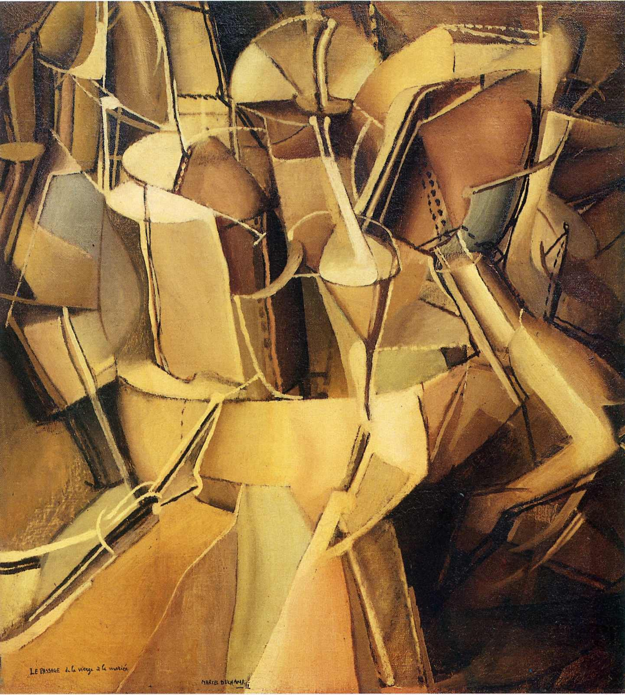

## 基本信息

- 作者：[[杜尚 Marcel Duchamp]]
- 创作年代：1912
- 材质：布面油画 (*not from wiki*)
- 尺寸：59.4 × 54 cm (*not from wiki*)
- 现存地：纽约现代艺术博物馆 (MoMA) (*not from wiki*)

## 画面与技法

与 [[下楼梯的裸女 Nude Descending a Staircase No. 2]] 同年——同样是把动作分解、把不同时间放进同一幅画的思路。顾衡评："这幅画我却看不出个子丑寅卯来。杜尚这个人，一天到晚的就喜欢故弄玄虚。"

## 历史背景

(*not from wiki*) 1912 年作于慕尼黑停留期间——这一年是杜尚由"未来主义+立体主义"过渡到他后来"机器学新娘"（[[杜尚 Marcel Duchamp]] 的《大玻璃 / 新娘被她的男人们扒光衣服》）的关键年。

## 图片清单

| 编号 | 出自 | 描述 |
|---|---|---|
| 01 | [[080｜什么是未来主义？]] | 整体图 |

## 出现在

- [[080｜什么是未来主义？]]
