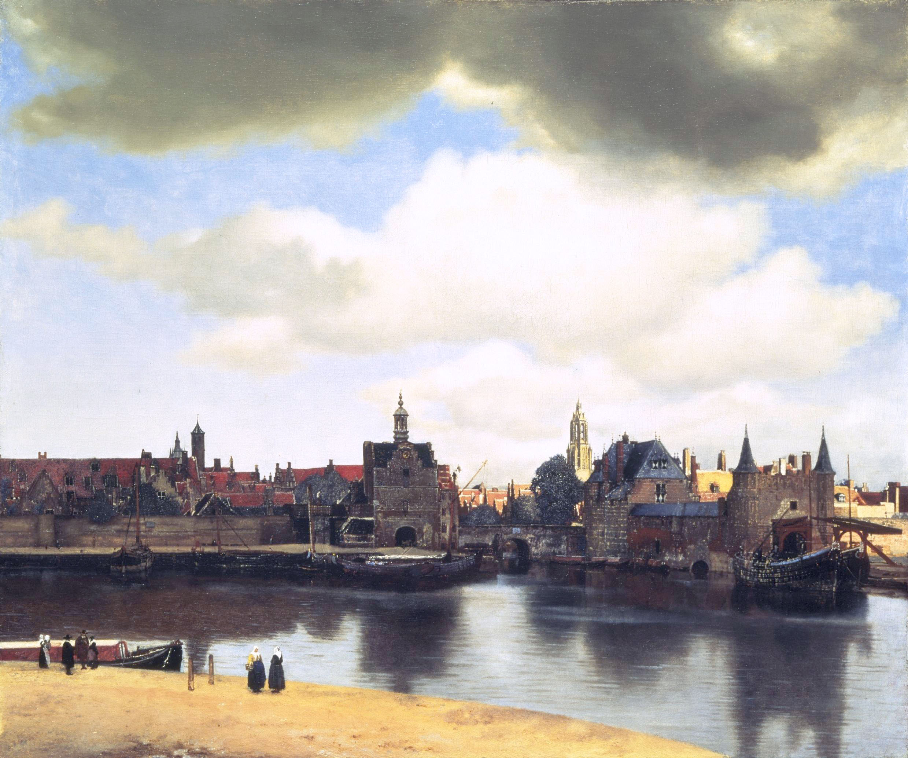

## 基本信息

- 作者：[[维米尔 Vermeer]]
- 创作年代：约 1660–1661
- 材质：布面油画 (*not from wiki*)
- 尺寸：96.5 × 115.7 cm (*not from wiki*)
- 现存地：海牙莫瑞泰斯皇家美术馆 (Mauritshuis, The Hague) (*not from wiki*)

## 画面与技法

**水平远景**：

- 前景：码头 / 河岸——几个**小小的人物**点景
- 中景：代尔夫特城墙、城门（Schiedam 与 Rotterdam 双塔门）
- 远景：城内屋顶、教堂尖塔（Nieuwe Kerk 塔被阳光照亮）
- 天空：占画面**上半部**——多层云、半阴半晴

**顾衡 037 重点**：

- "**画得跟彩色照片似的**——要说他没有用 [[小孔成像法 Camera Obscura]]，我是不信的"
- 顾衡用本作论证：**被意大利抛弃的俯瞰构图法在荷兰与小孔成像结合，大行其道**
- 制度背景：荷兰是**新教国家**，教堂不让画基督与圣母 → **风景画在荷兰率先成为独立画种**——17 世纪中叶**80% 荷兰家庭墙上都有一幅风景画或静物画**

**形式上**：

- **光斑的圆形虚化**（点状高光处的"光圈"）——是 [[小孔成像法 Camera Obscura]] **未对焦的镜头特征**——维米尔忠实地把镜头里看到的"散景"画了出来（*not from wiki*）
- **天光占画面 60% 以上**——荷兰风景画的标志构图

## 历史背景

(*not from wiki*) 代尔夫特是维米尔本人的故乡。本作是其少数风景画作之一（多数为室内风俗画）。马塞尔·普鲁斯特《追忆似水年华》里**贝戈特之死**就是在卢浮宫看到本作的"小块黄墙"后死去——20 世纪知名度从此暴增。1822 年由海牙王国收购，至今未移馆。

## 图片清单

| 编号 | 出自 | 描述 |
|---|---|---|
| 01 | [[037｜为什么说古典时代没有风景画？]] | 整体图 |

## 出现在

- [[037｜为什么说古典时代没有风景画？]]
