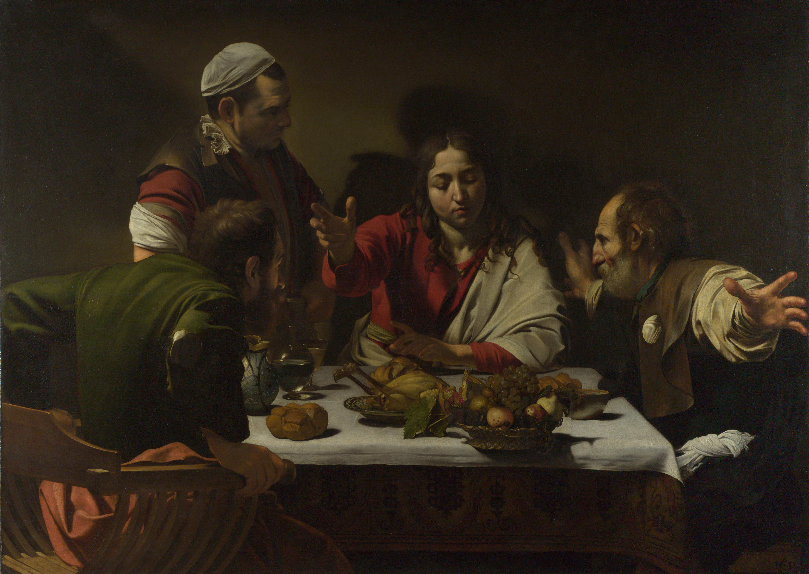

## 基本信息

- 作者：[[卡拉瓦乔 Caravaggio]]
- 创作年代：1601–1602
- 材质：布面油彩 (*not from wiki*)
- 尺寸：141 × 196.2 cm (*not from wiki*)
- 现存地：伦敦国家美术馆 (National Gallery, London) (*not from wiki*)

## 画面与技法

复活后的 **耶稣** 与两名门徒在以马忤斯村客栈共进晚餐——耶稣举手祝祷面包的一刻，两位门徒突然认出了他。

**戏剧性瞬间凝定**：
- 左侧门徒 **猛地推椅起身**（椅背被画出强烈侧出）；
- 右侧门徒 **双臂大幅伸展** 仿佛要拥抱（手向画外伸出，制造 **[[短缩法 Foreshortening]]** 的纵深震撼）；
- 中央年轻无须的耶稣（不同于传统圣像中的须发耶稣）平静举手祝祷；
- 桌上鸡、葡萄、面包、酒瓶、水果篮（**水果篮悬于桌沿、似将滑落** — 致敬卡拉瓦乔自己的早期 [[水果篮静物 Still Life by a Basket of Fruit]]）。

**[[酒窖光 Tenebrism]] 应用**：背景全黑、强光从画外左上方打来——耶稣的脸 / 手势成为视觉焦点。

## 历史背景

(*not from wiki*) 银行家 Ciriaco Mattei 委托。卡拉瓦乔后来 (1606) 又画了一版（藏米兰布雷拉美术馆），气氛更暗淡 / 节制——通常被视作他被通缉、心境改变后的回声。

## 图片清单

| 编号 | 出自 | 描述 |
|---|---|---|
| 01 | [[023｜卡拉瓦乔：巴洛克的戏剧性从何而来？]] | 整体图 |

## 出现在

- [[023｜卡拉瓦乔：巴洛克的戏剧性从何而来？]]
