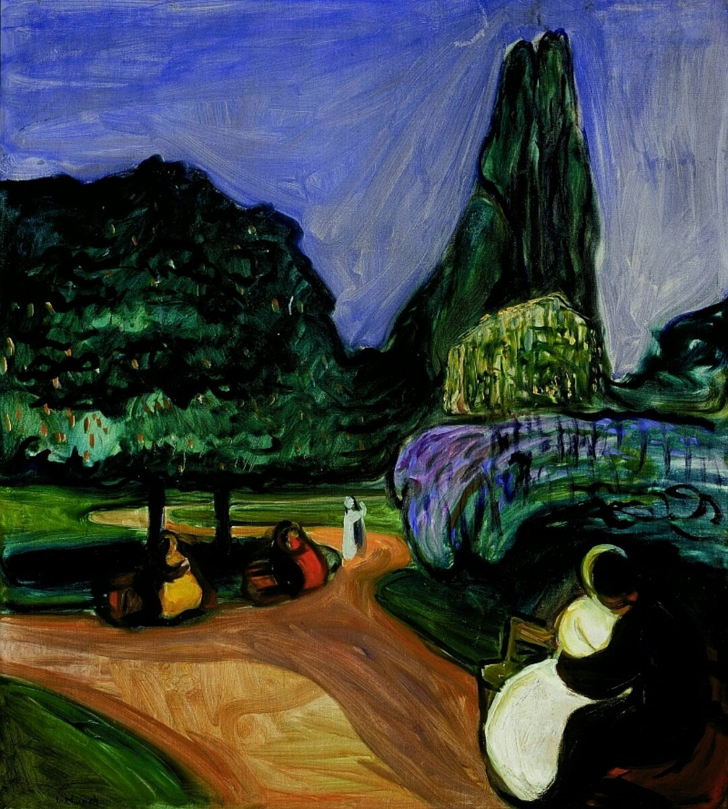

## 基本信息

- 作者：[[爱德华·蒙克 Edvard Munch]]
- 创作年代：1899
- 材质：布面油画 (*not from wiki*)
- 尺寸：未注明
- 现存地：未注明

## 画面与技法

前景一对年轻人拥吻，但整体氛围与 [[星月夜 The Starry Night]] 同构——**北方哥特风**的阴暗、冷峻和恐怖（顾衡 070）。蒙克借这幅画把"北欧式幻想空间"的细长、高耸、鬼气体感外化在 Studenterlunden（学生林）这一奥斯陆实景中。

## 历史背景 (*not from wiki*)

Studenterlunden 是奥斯陆市中心的一片小树林，紧邻奥斯陆国家剧院与学生公寓——蒙克在此频繁创作"夏夜情侣"母题。本作属蒙克 1890s 末期把象征主义气氛拢入风景与情境的过渡之作。

## 图片清单

| 编号 | 出自 | 描述 |
|---|---|---|
| 01 | [[070｜蒙克1：表现主义的先行者经历了什么？]] | 前景拥吻情侣 + 远景树林夜空 |

## 出现在

- [[070｜蒙克1：表现主义的先行者经历了什么？]]
