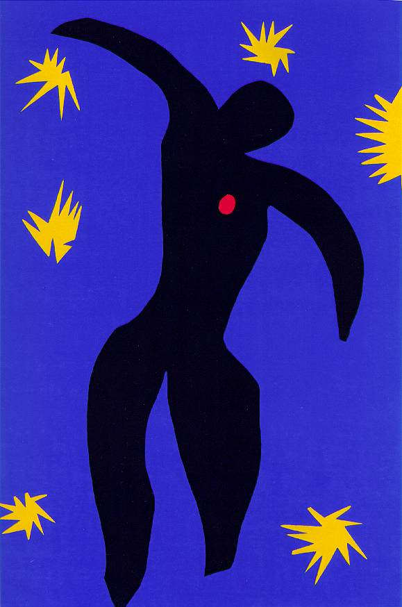

## 基本信息

- 作者：[[马蒂斯 Henri Matisse]]
- 创作年代：1944
- 材质：[[剪纸 Cut-outs]] —— 水粉彩纸剪贴 (*not from wiki*)
- 尺寸：(*not from wiki*)
- 现存地：(*not from wiki* 1947 出版于剪纸画册《Jazz》)

## 画面与技法

062 援引为马蒂斯**剪纸**早期的代表作——背景是这样的逻辑：

- 因为要把形状简化到极致，再研究它与颜色的关系
- 那么**最方便的办法就是剪纸**——"用纸剪个形状比在布上画一个要简单得多"

由此马蒂斯进入 [[剪纸 Cut-outs]] 时期。

(*not from wiki*) 画面为深蓝底色、剪出黑色伊卡洛斯轮廓 + 黄色星形点缀 + 心脏位置一颗红色心；身体姿态呈坠落感——典型把"形状简化到极致"的样板。

## 历史背景 *(not from wiki)*

(*not from wiki*) 出自马蒂斯 1947 年出版的剪纸画册《Jazz》——是他**剪纸技法从辅助工具升格为艺术本身**的里程碑作品集之一。伊卡洛斯是希腊神话中用蜡翼飞行、过近太阳而坠落的少年。

## 图片清单

| 编号 | 出自 | 描述 |
|---|---|---|
| 01 | [[062｜马蒂斯3：如何理解他一生的创作？]] | 深蓝底色 / 黑色坠落人形 / 黄色星点 / 红心 |

## 出现在

- [[062｜马蒂斯3：如何理解他一生的创作？]] —— 剪纸技法第一件代表作
