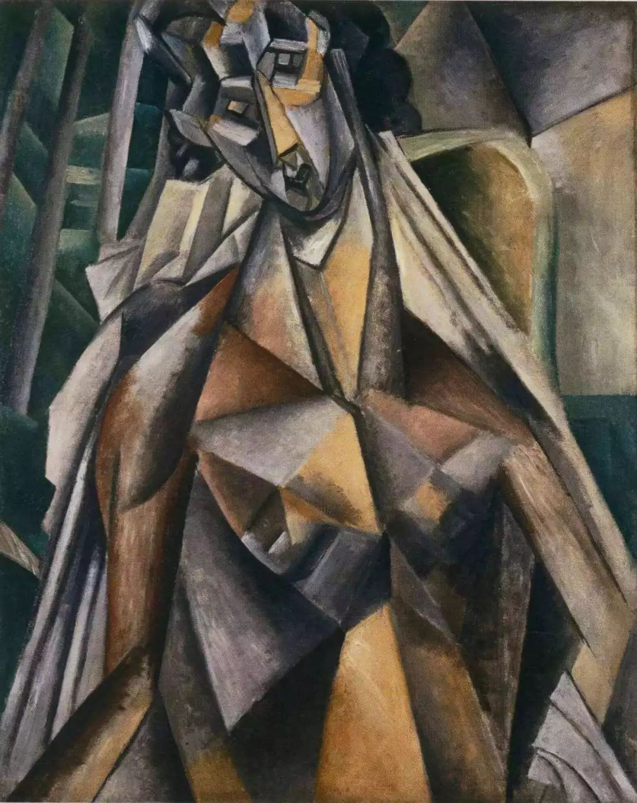

## 基本信息

- 作者：[[毕加索 Pablo Picasso]]
- 创作年代：1908
- 材质：(*not from wiki*) 布面油画
- 尺寸：年代不详
- 现存地：年代不详

## 画面与技法

[[分析立体主义 Analytic Cubism]] 时期作品；画面以**单一褐色调**呈现伊娃坐在扶手椅中的形象——人物表相被分解为几何切面、各种扭曲与位置移动后，颜色被**有意抹掉**以避免对"本质碎片"的干扰。顾衡 067 用本作示例分析立体主义的"无色"原则。

> 注：raw caption 标注 1908，但学界一般认为毕加索与"伊娃" ([[伊娃·古埃尔 Eva Gouel]]) 的关系始于 1911-1912 年；本作的标题与年份组合可能存在错植，需要再核。

## 历史背景

(*not from wiki*) 伊娃·古埃尔 (Eva Gouel, 原名 Marcelle Humbert) 是毕加索 1911-1915 年间的情人，毕加索在多幅作品里题写"J'aime Eva"（我爱伊娃）。她 1915 年去世，是毕加索一生中少数得到艺术家公开深情纪念的女性。

## 图片清单

| 编号 | 出自 | 描述 |
|---|---|---|
| 01 | [[067｜毕加索4：什么是综合立体主义？]] | 整体图（褐色调） |

## 出现在

- [[067｜毕加索4：什么是综合立体主义？]]
