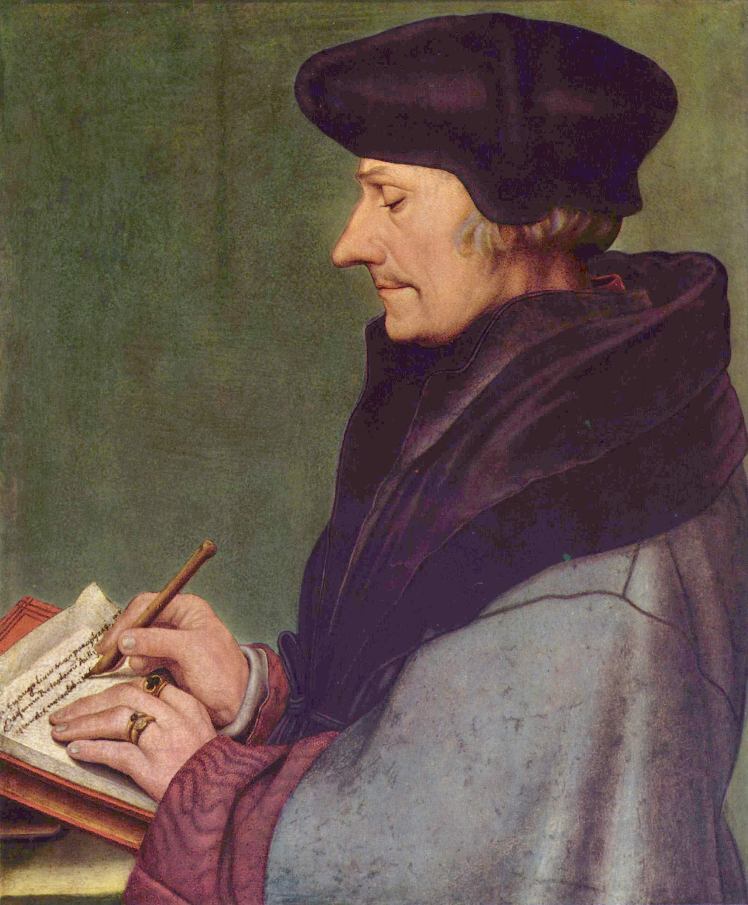
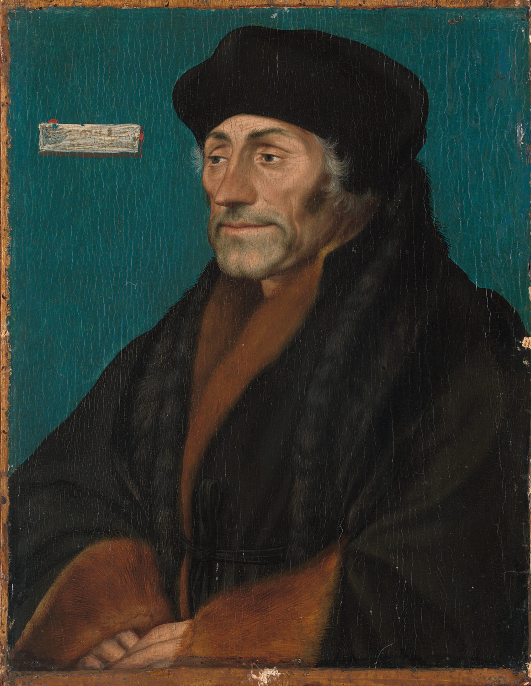
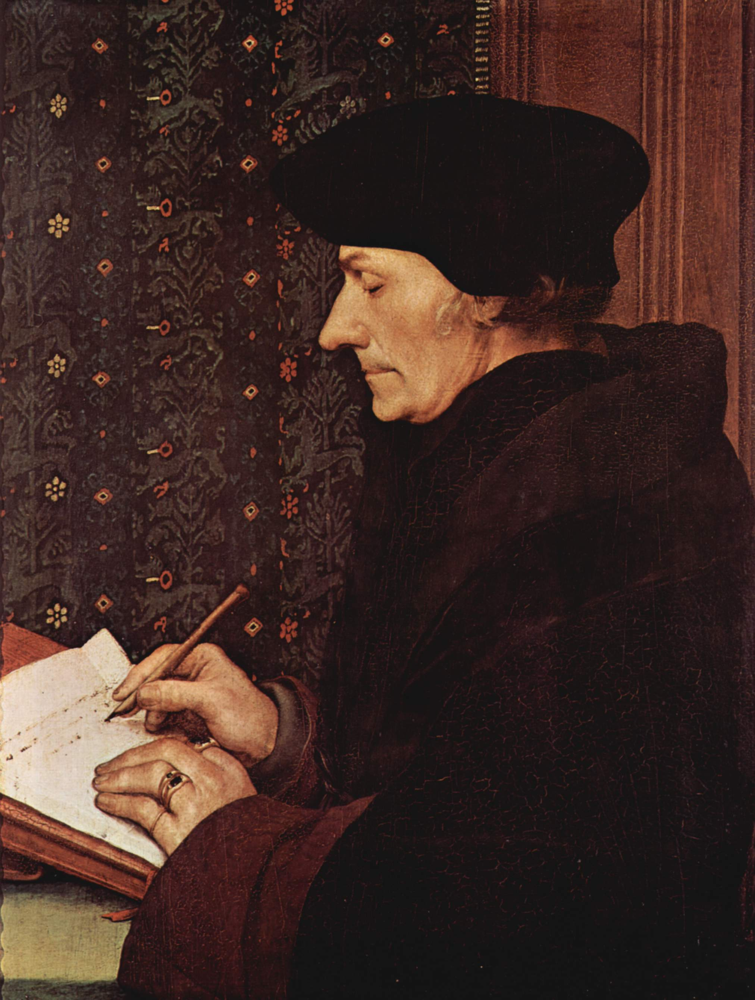

## 基本信息

- 作者：[[荷尔拜因 Hans Holbein the Younger]]
- 创作年代：1523–1524 (顾衡引 "1523年" 与 "1524年" 三幅)
- 材质：木板油彩 (*not from wiki*)
- 尺寸：多版本，约 42 × 32 cm 起 (*not from wiki*)
- 现存地：多版本分藏——卢浮宫（"书写中的伊拉斯谟"，1523）、National Gallery London（侧面像）、Basel Kunstmuseum 等 (*not from wiki*)

## 画面与技法

[[伊拉斯谟 Erasmus of Rotterdam]] 的肖像三幅（1523、1523、1524）——典型表现是**侧面 / 三分之四面、伊拉斯谟在写作或思考**，常配书桌、墨水瓶、书籍。佛兰德斯式细节——衣物毛皮、手部姿态、纸张文字都纤毫毕现。

**功能**：人文主义"学者肖像"的范式。伊拉斯谟亲自把这些像**复制多幅、到处送朋友**——成为他建立欧洲学术声誉的"名片"。这是 16 世纪欧洲精英网络的"图像 + 文本"复合通讯模式。

## 历史背景

(*not from wiki*) [[荷尔拜因 Hans Holbein the Younger]] 1514 起在巴塞尔结识 [[伊拉斯谟 Erasmus of Rotterdam]]——给后者《愚人颂》画插画——前后画了三幅肖像。**人脉意义**：伊拉斯谟的推荐把荷尔拜因引向英国 [[托马斯·莫尔 Sir Thomas More]]——开启了他在英国的事业。

## 图片清单

| 编号 | 出自 | 描述 |
|---|---|---|
| 01 | [[021｜荷尔拜因：为什么要画那么多肖像画？]] | 第一幅 (1523, 书写中的侧面像) |
| 02 | [[021｜荷尔拜因：为什么要画那么多肖像画？]] | 第二幅 (1523) |
| 03 | [[021｜荷尔拜因：为什么要画那么多肖像画？]] | 第三幅 (1524) |

## 出现在

- [[021｜荷尔拜因：为什么要画那么多肖像画？]]
